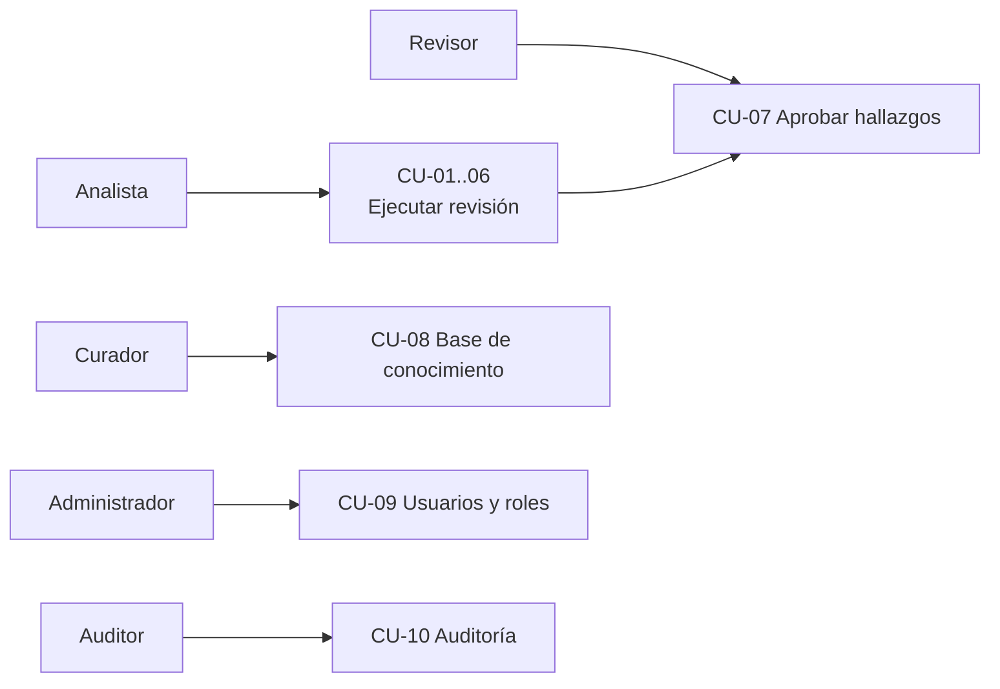
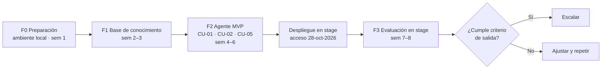

# Requerimiento formal (SRS) — Agente Administrativo

**Versión:** 0.6 (borrador para validación)
**Fecha:** 2026-09-24
**Relacionado con:** docs/00-rol-y-lineamientos.md

| Campo | Valor |
| --- | --- |
| Proyecto | Laboratorio de IA – Agente de validación documental |
| Autor | Rene Rosales (con apoyo de Claude) |
| Organización | SFC-Team · Servicios Compartidos |
| Estado | En revisión – ver sección 17 (información pendiente) |

> Convención: `[POR CONFIRMAR]` = dato que debe aportar el negocio antes de aprobar el documento. Todos los diagramas del proyecto se elaboran únicamente en Mermaid.

## 1. Antecedentes
- Se solicitó crear un laboratorio de IA sobre infraestructura propia (inicialmente equipo reciclado o VM) para apoyar la revisión de documentos.
- Hoy la validación de documentos (cuadres contables, redacción, ortografía, actualización normativa, controles, transcripción de imágenes) es manual.
- Volumen actual: ~1,000 documentos revisados al mes; cada revisión toma hasta 1 hora según el documento y el caso (≈ 1,000 horas-persona/mes en el peor caso, aprox.).
- Área patrocinadora: Servicios Financieros Compartidos (SFC). Área piloto: Contabilidad.
- [POR CONFIRMAR: errores o incidentes recientes que motivan el proyecto.]
- Se dispone de un servidor con 2 procesadores, 384–512 GB de RAM y 4 TB de disco (se solicitaron 8 TB), virtualizado con Proxmox VE. Sin GPU en la primera entrega; se contempla agregar una GPU de al menos 128 GB de VRAM en una fase posterior.
- El servidor es físico: TI instala Proxmox VE y luego la infraestructura virtual. El ambiente stage no estará disponible hasta que se otorgue acceso, por lo que el desarrollo se realiza en un ambiente local y se documenta el despliegue a stage (ver [docs/03-diseno/despliegue/estrategia-ambientes.md](../03-diseno/despliegue/estrategia-ambientes.md)).
- Existe un análisis inicial y un prototipo de diseño de 3 pantallas (ver [docs/02-analisis/01-analisis-inicial.md](../02-analisis/01-analisis-inicial.md)).

## 2. Problema
La revisión manual de documentos es lenta, depende de la persona que revisa y no deja registro uniforme de qué se validó y contra qué regla. Los errores (descuadres, cuentas inválidas, ortografía, normativa desactualizada) llegan a etapas posteriores o a terceros.

## 3. Objetivo general
Implementar un laboratorio de IA on-premise en el que un agente valide, analice y proponga correcciones a documentos institucionales (Excel, Word, PowerPoint, PDF, imágenes y texto) con base en una base de conocimiento controlada, con revisión humana obligatoria y trazabilidad completa.

## 4. Objetivos específicos
| ID | Objetivo específico | Indicador (meta a confirmar) |
| --- | --- | --- |
| OE-01 | Detectar y explicar descuadres y errores en archivos Excel contables | ≥ 90 % de errores sembrados detectados |
| OE-02 | Revisar ortografía, gramática y redacción en texto, Excel, Word, PowerPoint y PDF | ≥ 90 % detectados, ≤ 10 % falsos positivos |
| OE-03 | Identificar contenido desactualizado frente a la normativa vigente | ≥ 80 % de secciones desactualizadas identificadas |
| OE-04 | Convertir imágenes y PDF escaneados a texto editable (OCR) | Precisión de caracteres ≥ 95 % en documentos legibles |
| OE-05 | Operar una base de conocimiento gobernada (versiones, vigencia, dueños) | 100 % de fuentes con dueño y vigencia |
| OE-06 | Operar con seguridad: usuarios, roles por área, segregación de funciones y auditoría | 100 % de acciones en bitácora |
| OE-07 | Reducir el tiempo de revisión frente a la revisión manual | Documento complejo resuelto en ≤ 10 min (meta 5–10 min) vs. hasta 60 min manual (≥ 83 % de reducción) |

## 5. In-Scope / Out-of-Scope
| In-Scope (piloto) | Out-of-Scope (piloto) |
| --- | --- |
| Interfaz web interna en español | Acceso desde internet o aplicación móvil |
| Revisión de Excel contable, redacción PDF/Word, actualización normativa, controles | Integración con ERP / sistema contable |
| Revisión ortográfica de texto, Excel, Word, PowerPoint y PDF | Traducción entre idiomas |
| OCR de imágenes (.jpg, .png, .tiff) y PDF escaneados | Audio, video y escritura a mano ilegible |
| Base de conocimiento de 20–50 documentos con gobierno por curadores | Ingesta automática masiva de repositorios completos |
| Revisión humana (aceptar/rechazar) y documento corregido en borrador | Aprobación o publicación automática sin humano |
| Usuarios, roles por área, bitácora de auditoría | Firma electrónica / flujo documental corporativo |
| 5–10 usuarios, 1 VM en Proxmox, ejecución en CPU | Alta disponibilidad multi-servidor, GPU (fase posterior) |
| Modelos open source preentrenados | Entrenamiento o fine-tuning de modelos |
| Plan de pruebas y métricas del piloto | Soporte 24/7 |
| Desarrollo en ambiente local (Docker) y guía de despliegue a stage en Proxmox | Instalación del servidor físico y de Proxmox VE (responsabilidad de TI) |

## 6. Interesados y roles
| Rol | Descripción |
| --- | --- |
| Patrocinador | Servicios Financieros Compartidos (SFC); aprueba alcances y recursos. Responsable nominal [POR CONFIRMAR] |
| Administrador (TI) | Usuarios, roles, servidor, modelos, respaldos |
| Curador de conocimiento | Uno por área; aprueba fuentes vigentes |
| Revisor / Aprobador | Acepta o rechaza hallazgos y libera documentos |
| Analista | Sube documentos y ejecuta análisis |
| Auditor / Consulta | Solo lectura de historial y bitácora |

## 7. Supuestos y restricciones
- On-premise, sin envío de documentos a servicios externos.
- Servidor físico: 2 CPU, 384–512 GB RAM, 4 TB; TI instala Proxmox VE y la VM stage; ejecución inicial solo en CPU.
- Acceso al stage previsto para el **28 de octubre de 2026**; mientras tanto se desarrolla en local (Windows + WSL2 + Docker Desktop; Intel Core Ultra 7, 128 GB de RAM, disco SSD, sin GPU dedicada) con los mismos modelos MoE en CPU (gpt-oss-20b / Qwen3-30B-A3B).
- GPU: fuera de la primera entrega. Se prevé agregar al servidor una GPU (o conjunto de GPUs) de al menos 128 GB de VRAM en una fase posterior; la arquitectura permite cambiar de Ollama/llama.cpp a vLLM sin cambiar código (RNF-10). [POR CONFIRMAR modelo de GPU]
- La VM stage no tiene salida a internet: imágenes y modelos se despliegan como paquete offline.
- Software open source, sin costo de licencia.
- Idioma principal: español (Guatemala).
- Moneda: quetzales (Q) o dólares ($); los documentos pueden venir en cualquiera de las dos.
- Documentos de hasta **1 GB** por archivo; retención de documentos y resultados: **3 meses**.
- Entrega 1 (MVP) prioriza **CU-01, CU-02 y CU-05**; el resto de casos se incorpora en iteraciones siguientes.
- [POR CONFIRMAR] Modelo de CPU y tipo de disco del servidor; existencia de Active Directory; tamaño promedio de documento.

## 8. Requerimientos (generales / de negocio)
Necesidades de alto nivel del negocio; cada uno se descompone en RF y RNF.

| ID | Requerimiento | Deriva en |
| --- | --- | --- |
| RG-01 | La organización necesita validar documentos contables antes de su cierre o entrega | RF-03..06, RF-12..15 |
| RG-02 | Los documentos institucionales deben salir sin errores de ortografía y con redacción estándar | RF-07, RF-10, RF-17 |
| RG-03 | Los procedimientos y manuales deben reflejar la normativa vigente | RF-08, RF-16 |
| RG-04 | Los controles internos deben poder evidenciarse de forma uniforme | RF-09, RF-19 |
| RG-05 | La información en imágenes o escaneos debe poder reutilizarse como texto | RF-11 |
| RG-06 | Ninguna corrección se aplica sin aprobación de una persona responsable | RF-13, RF-14, RNF-02 |
| RG-07 | La información sensible no sale de la infraestructura de la organización | RNF-01, RNF-02 |
| RG-08 | Toda acción debe ser auditable | RF-19, RNF-06 |

> Nota de trazabilidad: RF-01, RF-02, RF-18 y RF-20 no tienen un RG asociado explícito en esta tabla (funcionalidad base de plataforma). Ver [04-matriz-trazabilidad.md](04-matriz-trazabilidad.md).

## 9. Stack tecnológico
| Capa | Tecnología propuesta | Alternativa | Función |
| --- | --- | --- | --- |
| Ambiente local | Windows + WSL2 + Docker Desktop | Podman Desktop, Linux nativo | Desarrollo y pruebas unitarias |
| Infraestructura | Servidor físico 2 CPU / 384–512 GB / 4 TB | GPU ≥ 128 GB VRAM (fase 2) | Cómputo |
| Virtualización | Proxmox VE + Proxmox Backup Server | — | VM, snapshots, respaldos |
| Sistema operativo | Ubuntu Server 24.04 LTS | Debian 12 | Base de la VM |
| Contenedores | Docker + Docker Compose | Podman | Despliegue de servicios |
| Proxy / TLS | Nginx o Traefik | Caddy | HTTPS interno |
| Interfaz web | Open WebUI (piloto) → UI propia (React) | AnythingLLM | Carga, resultados, revisión |
| API / orquestador | Python 3.12 + FastAPI + LangGraph | Python propio, n8n | Flujo del agente y herramientas |
| Cola de trabajos | Redis + Celery / RQ | — | Procesamiento asíncrono |
| Motor LLM | Ollama / llama.cpp | vLLM (con GPU) | Inferencia local |
| Modelos LLM | gpt-oss-120b / 20b, Qwen3-30B-A3B (MoE, CPU) | Qwen 7–14B, Llama 3.x 8B, Mistral, Gemma | Razonamiento y redacción |
| Embeddings | bge-m3 | nomic-embed-text, multilingual-e5 | Indexación semántica |
| Base vectorial | Qdrant | pgvector, Chroma | Búsqueda RAG |
| Base relacional | PostgreSQL 16 | — | Usuarios, análisis, hallazgos, bitácora |
| Almacenamiento de archivos | Sistema de archivos cifrado / MinIO | — | Documentos originales y corregidos |
| Parsers | openpyxl, pandas, python-docx, python-pptx, Docling, PyMuPDF | Unstructured | Lectura de formatos |
| OCR | Tesseract + OpenCV | PaddleOCR | Imagen a texto |
| Ortografía | LanguageTool (servidor local) + Hunspell es | — | Ortografía y gramática |
| Identidad | Active Directory / LDAP (Keycloak si se requiere SSO) | Usuarios locales | Autenticación y roles |
| Observabilidad | Langfuse + Prometheus + Grafana | Loki | Trazas de prompts, métricas, logs |
| Diagramas y docs | Markdown + Mermaid | — | Documentación versionada |
| Control de versiones | Git (GitLab / GitHub interno) | — | Código y docs |

## 10. Requerimientos funcionales
Prioridad MoSCoW: M = debe, S = debería, C = podría.

| ID | Requerimiento | Prioridad |
| --- | --- | --- |
| RF-01 | Autenticar usuarios con cuentas de la organización (AD/LDAP) o locales | M |
| RF-02 | Administrar usuarios, roles y permisos por área | M |
| RF-03 | Cargar documentos .xlsx, .docx, .pptx, .pdf, .jpg, .png, .tiff y texto pegado (tamaño máx. 1 GB por archivo; carga por partes y reanudable) | M |
| RF-04 | Seleccionar el tipo de revisión: contable, redacción, actualización normativa, control, ortografía, OCR | M |
| RF-05 | Seleccionar las fuentes de la base de conocimiento a consultar | M |
| RF-06 | Validar Excel contable: cuadre debe/haber, totales, fórmulas, cuentas vs. catálogo, duplicados, período | M |
| RF-07 | Revisar redacción, tono y estructura de PDF y Word contra la guía de estilo | M |
| RF-08 | Detectar contenido desactualizado de Word/PDF frente a la normativa vigente | S |
| RF-09 | Evaluar documentos contra checklists de control (cumple / no cumple / revisar) | S |
| RF-10 | Revisar ortografía y gramática en texto, Excel (celda), Word (párrafo), PowerPoint (diapositiva y notas) y PDF (página) con ubicación exacta | M |
| RF-11 | Convertir imágenes y PDF escaneados a texto (OCR) con nivel de confianza y salida .docx/.txt/.xlsx (**iteración 2**) | S |
| RF-12 | Presentar cada hallazgo con severidad, ubicación, explicación, corrección sugerida y fuente citada | M |
| RF-13 | Permitir aceptar, rechazar o deshacer cada hallazgo | M |
| RF-14 | Generar el documento corregido en su formato original aplicando solo las correcciones aceptadas | M |
| RF-15 | Generar reporte PDF de hallazgos | S |
| RF-16 | Gestionar la base de conocimiento: carga, versión, vigencia, aprobación por curador y reindexación | M |
| RF-17 | Mantener glosario/diccionario interno (siglas, nombres propios, términos técnicos) | S |
| RF-18 | Consultar historial de análisis con filtros (usuario, área, tipo, estado, fecha) | S |
| RF-19 | Registrar bitácora de auditoría de todas las acciones | M |
| RF-20 | Enviar un análisis a un revisor y notificarlo | C |

## 11. Requerimientos no funcionales
| ID | Categoría | Requerimiento |
| --- | --- | --- |
| RNF-01 | Privacidad | Procesamiento 100 % local; la VM no tiene salida a internet en operación |
| RNF-02 | Seguridad | HTTPS interno, cifrado de disco, RBAC por área, segregación de funciones (quien carga no aprueba) |
| RNF-03 | Exactitud | Todo cálculo numérico lo hace código determinista; el LLM no genera cifras |
| RNF-04 | Rendimiento | Documento complejo en ≤ 10 min (meta 5–10 min); documento típico ≤ 5 min; ortografía ≤ 1 min (medido en stage) |
| RNF-05 | Capacidad de proceso | ~1,000 documentos/mes (~50 por día hábil); con ≤ 10 min por documento se requieren ≥ 2 workers en paralelo para terminar en la jornada (aprox.); 5–10 usuarios del piloto con cola de trabajos |
| RNF-06 | Trazabilidad | Cada hallazgo guarda regla, versión de la fuente, modelo y versión del prompt |
| RNF-07 | Disponibilidad | Horario laboral; RPO 24 h, RTO 4 h |
| RNF-08 | Capacidad | Operar dentro de 4 TB |
| RNF-09 | Usabilidad | Web, sin instalación, en español, accesible (WCAG AA) |
| RNF-10 | Mantenibilidad | Servicios en Docker; modelos intercambiables sin cambiar código |
| RNF-11 | Observabilidad | Registro de prompts, tiempos, errores y consumo de recursos |
| RNF-12 | Retención | Documentos originales, corregidos y resultados se conservan 3 meses y luego se eliminan de forma automática y auditada; la bitácora de auditoría se conserva [POR CONFIRMAR] |
| RNF-13 | Documentación | Toda la documentación en Markdown dentro de `docs/`; diagramas y flujos solo en Mermaid |
| RNF-14 | Portabilidad | El mismo artefacto (imágenes con el mismo tag) corre en local y stage; solo cambia la configuración (`compose.<ambiente>.yml`, `.env.<ambiente>`); despliegue a stage offline y reversible por snapshot |

## 12. Casos de uso (resumen)
Detalle en [docs/01-requerimientos/02-casos-de-uso.md](02-casos-de-uso.md). **Entrega 1: CU-01, CU-02, CU-05.**

| ID | Caso de uso | Actor principal | RF | Entrega |
| --- | --- | --- | --- | --- |
| CU-01 | Validar Excel contable | Analista | RF-03..06, 12..15 | 1 |
| CU-02 | Revisar redacción PDF/Word | Analista | RF-07, 12..14 | 1 |
| CU-03 | Verificar actualización normativa | Analista | RF-08, 12 | 2 |
| CU-04 | Evaluar control/checklist | Analista | RF-09, 12 | 2 |
| CU-05 | Revisar ortografía multi-formato | Analista | RF-10, 17, 14 | 1 |
| CU-06 | Convertir imagen a texto (OCR) | Analista | RF-11 | 2 |
| CU-07 | Aprobar o rechazar hallazgos | Revisor | RF-13, 14, 20 | 1 (transversal) |
| CU-08 | Gestionar base de conocimiento | Curador | RF-16, 17 | 1 (transversal) |
| CU-09 | Administrar usuarios y roles | Administrador | RF-01, 02 | 1 (transversal) |
| CU-10 | Consultar auditoría | Auditor | RF-18, 19 | 1 (transversal) |

## 13. Historias de usuario
Ver [docs/01-requerimientos/03-historias-de-usuario.md](03-historias-de-usuario.md).

## 14. Pruebas de prototipo
Ver [docs/04-pruebas/plan-pruebas-prototipo.md](../04-pruebas/plan-pruebas-prototipo.md).

## 15. Riesgos
Detalle y seguimiento en [docs/02-analisis/03-riesgos.md](../02-analisis/03-riesgos.md).

| ID | Riesgo | Probabilidad | Impacto | Mitigación | Responsable |
| --- | --- | --- | --- | --- | --- |
| R-01 | El LLM inventa cifras o reglas | Media | Alto | RNF-03 + citas obligatorias (RF-12) | Líder técnico |
| R-02 | Rendimiento insuficiente solo con CPU | Media | Medio | Modelos MoE, NUMA, cola; GPU ≥ 128 GB VRAM en fase 2 | TI |
| R-03 | Base de conocimiento desactualizada | Media | Alto | RF-16, curadores, revisión trimestral | Curadores |
| R-04 | Fuga de información sensible | Baja | Alto | RNF-01, RNF-02, segmentación de red | TI / Seguridad |
| R-05 | OCR de baja calidad en imágenes deficientes | Alta | Medio | Umbral de confianza, marcar texto dudoso | Líder técnico |
| R-06 | Corrección ortográfica altera formato del archivo | Media | Medio | Editar a nivel de texto sin tocar estilos; PP-04 | Líder técnico |
| R-07 | Capacidad de disco (4 TB) insuficiente: archivos de hasta 1 GB × ~3,000 documentos en 3 meses podrían superar la capacidad en el peor caso | Media | Alto | Retención de 3 meses (RNF-12), monitoreo de uso, alerta al 70 %, compresión de originales, medir tamaño promedio real | TI |
| R-08 | Falta de datos reales para pruebas | Media | Alto | Dataset anonimizado con errores sembrados | Áreas usuarias |
| R-09 | Baja adopción | Media | Medio | Usuarios clave en piloto, métricas visibles | Patrocinador |
| R-10 | Acceso tardío al stage o diferencias local vs. stage | Alta | Medio | Paridad por contenedores (RNF-14), modelos parametrizados, guía de despliegue lista, PP de rendimiento solo en stage | Patrocinador / TI |

## 16. Plan del piloto

## 17. Información pendiente (para aprobar v1.0)
1. Errores o incidentes recientes que motivan el proyecto.
2. Responsable nominal del patrocinador (SFC) y de TI / Infraestructura.
3. Modelo de CPU y tipo de disco del servidor; ¿existe Active Directory?
4. Tamaño promedio de documento (para validar la capacidad de 4 TB, R-07).
5. Plazo de retención de la bitácora de auditoría.
6. Modelo de GPU para la fase 2.

## 18. Aprobaciones
| Rol | Nombre | Fecha | Firma |
| --- | --- | --- | --- |
| Patrocinador (SFC) | [POR CONFIRMAR] | | |
| TI / Infraestructura | [POR CONFIRMAR] | | |
| Responsable del proyecto | Rene Rosales | | |
