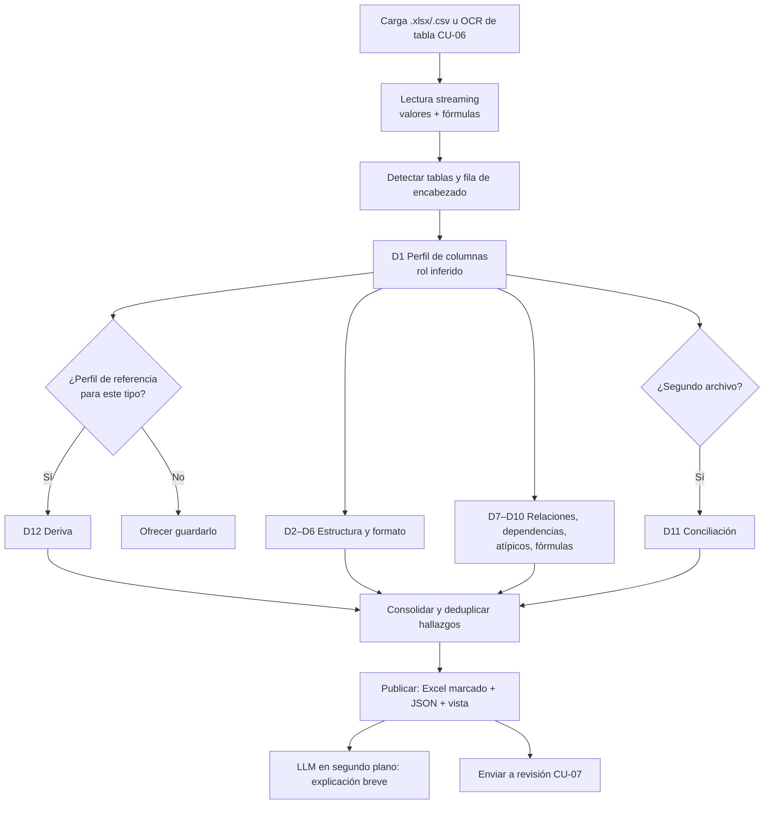
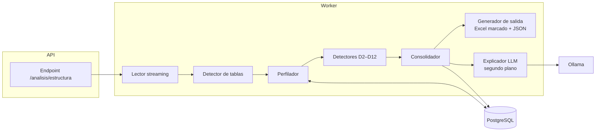
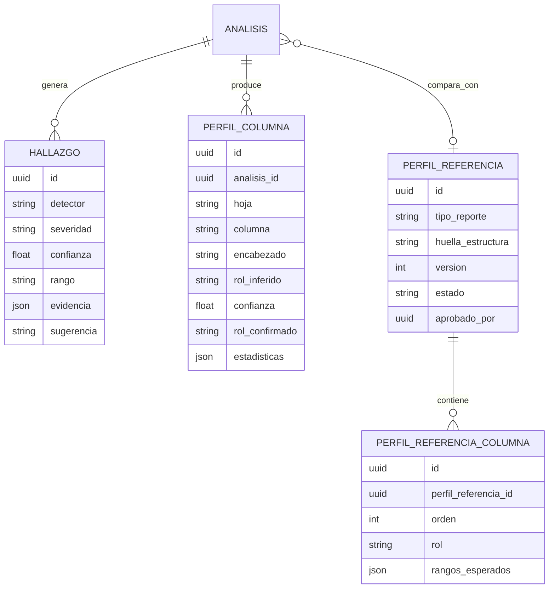

# 03 · Análisis CU-11 · Revisar estructura de hojas de cálculo (descuadre de columnas)

Versión 0.1 · 2026-10-07 · Estado: propuesta para aprobación del patrocinador · IDs RF/HU/PP/R provisionales (Claude Code asigna los siguientes libres)

## 1. Antecedentes
CU-01 valida Excel **contables** con reglas aritméticas (cuadre Debe/Haber, totales, fórmulas) y depende de que las columnas tengan nombres esperados; si no los encuentra pide mapeo manual. En la práctica, muchos archivos que revisa Contabilidad no son libros diarios: son reportes exportados, conciliaciones, planillas, anexos y consolidados, con encabezados distintos en cada área. Los errores más comunes en ellos **no son de suma**, sino de estructura: datos que se corrieron una columna al copiar y pegar, un bloque de filas con columnas en otro orden, montos guardados como texto, un código de cuenta con un nombre que no le corresponde, un valor 100 veces mayor por un separador decimal mal puesto. Hoy se detectan a ojo.

## 2. Objetivos
**General:** detectar descuadres de columnas en cualquier hoja de cálculo sin depender del nombre de los encabezados ni de que existan fórmulas, explicando cada hallazgo con su ubicación exacta.

**Específicos:**
1. Inferir el **rol** de cada columna (fecha, monto, código, identificador, texto, moneda, porcentaje) a partir de su contenido; el encabezado es solo una pista.
2. Detectar **corrimientos** de celdas, filas y bloques respecto al perfil de la columna.
3. **Descubrir relaciones** entre columnas que se cumplen en casi todas las filas (C = A × B, saldo acumulado, código → nombre) y señalar las filas que las rompen, aunque los valores estén pegados sin fórmula.
4. Comparar la hoja contra **otra hoja o archivo** (conciliación) emparejando columnas por contenido, no por nombre.
5. Comparar contra un **perfil de referencia** guardado del mismo tipo de reporte (deriva de estructura entre meses).
6. Mantener la regla del proyecto: todo cálculo lo hace el código; el LLM solo nombra y explica.

## 3. Alcance
| In-Scope | Out-of-Scope |
| --- | --- |
| .xlsx, .xlsm, .xls (convertido), .csv; varias hojas; tablas con encabezado en cualquier fila | Hojas sin estructura tabular (formularios libres, dashboards) → se informa |
| Inferencia de rol de columna por contenido + sinónimos del glosario | Adivinar el significado de columnas sin datos suficientes (se marca "indeterminado") |
| Corrimiento de celda, fila, bloque; columnas intercambiadas; encabezado repetido a mitad de hoja; columnas vacías intercaladas | Corregir automáticamente sin aprobación (las correcciones pasan por CU-07) |
| Tipos mezclados: número como texto, fechas en varios formatos, separadores decimales, monedas mezcladas | Conversión de moneda (requiere tipo de cambio; solo se señala) |
| Relaciones descubiertas (aritméticas, dependencias código→nombre, unicidad, orden, signo) y atípicos de magnitud | Modelos de ML entrenados con datos reales (no hay dataset etiquetado aún) |
| Fórmula inconsistente dentro de una columna (patrón distinto al vecino) | Auditoría completa de macros VBA |
| Conciliación hoja vs hoja / archivo vs archivo | Conexión directa a ERP o bases externas |
| Perfiles de referencia por tipo de reporte, aprobados por el curador | Edición colaborativa de la hoja en línea |
| Excel marcado + JSON de hallazgos + vista de perfil de columnas | — |

## 4. Stack tecnológico
| Capa | Elección | Nota |
| --- | --- | --- |
| Lectura | openpyxl (`read_only`, valores y fórmulas), pandas para perfilado | Ya en el proyecto (CU-01) |
| Cálculo | numpy; estadística robusta propia (mediana, MAD) | Sin librerías nuevas en la primera versión |
| Emparejamiento por contenido | Jaccard/solapamiento de valores + distribución numérica; bge-m3 (ya instalado) solo para sinónimos de encabezado | rapidfuzz solo con ADR |
| Explicación | LLM actual (ADR-008), una llamada por hoja, en segundo plano, texto plano | Hallazgos visibles sin esperar al LLM |
| Persistencia | PostgreSQL: perfiles de referencia y hallazgos | Tablas nuevas (ver ER) |
| UI | Pantallas existentes + vista "Perfil de columnas" | Reutiliza la vista progresiva |

## 5. Técnicas de detección (deterministas)
| # | Detector | Cómo funciona | Ejemplo de hallazgo |
| --- | --- | --- | --- |
| D1 | Perfil de columna | Cada celda recibe tipo (número, monto, fecha, código, texto, vacío) y "forma" (`AA-999`, `9999.99`). Tipo dominante ≥ 80 % = rol de la columna | "Columna E es monto (97 %)" |
| D2 | Celda fuera de perfil | Celda cuyo tipo no coincide con su columna | "E214 contiene texto 'Pago proveedor' en columna de montos" |
| D3 | Corrimiento de fila | En una fila, ≥ 3 celdas seguidas encajan con el perfil de la columna vecina (±1, ±2) | "Fila 214 corrida 1 columna a la derecha desde D" |
| D4 | Cambio de estructura por bloque | Punto de cambio del perfil a lo largo de las filas (ventana deslizante) | "Desde la fila 1,050 las columnas C y D están intercambiadas" |
| D5 | Encabezado o subtotal intercalado | Fila que repite el encabezado o tiene 'Total' y suma parcial | "Fila 400 repite encabezados" |
| D6 | Formato inconsistente | Número guardado como texto, fechas mixtas, coma/punto decimal, Q/$ mezclados | "12 montos guardados como texto en F" |
| D7 | Relaciones descubiertas | Prueba candidatas A±B, A×B, A/B, saldo previo ± movimiento; si se cumple en ≥ 95 % de filas con tolerancia, las filas que fallan son hallazgo | "G = E × F en 98 %; fila 77 no cumple (dif. Q 45.00)" |
| D8 | Dependencias | Código → nombre debe ser 1:1; identificador único; fecha ordenada | "Cuenta 1101 aparece con 2 nombres distintos" |
| D9 | Atípico de magnitud | Valor fuera de mediana ± k·MAD dentro de su grupo; detecta ×10/×100 | "H90 = 125,000.00; en su grupo la mediana es 1,250.00 (posible decimal)" |
| D10 | Fórmula inconsistente | Fórmula en notación R1C1 distinta a la de sus vecinas o valor fijo entre fórmulas | "F33 es valor fijo; el resto de F es =D*E" |
| D11 | Conciliación | Empareja columnas de dos tablas por contenido, define llave, compara filas faltantes y diferencias | "23 facturas en A no están en B; 4 con monto distinto" |
| D12 | Deriva contra perfil | Compara contra el perfil de referencia aprobado del mismo tipo de reporte | "Falta la columna 'Centro de costo'; orden distinto al de septiembre" |

Cada hallazgo lleva: detector, severidad, confianza (0–1), hoja, rango de celdas, evidencia numérica calculada por código y sugerencia (p. ej. "mover E214:H214 una columna a la izquierda").

## 6. Requerimientos funcionales (provisionales)
| ID | Requerimiento |
| --- | --- |
| RF-20 | Inferir rol y perfil de cada columna sin depender del nombre del encabezado; permitir que el usuario confirme o corrija el rol |
| RF-21 | Detectar corrimientos de celda, fila y bloque, encabezados intercalados y formatos inconsistentes (D2–D6) |
| RF-22 | Descubrir relaciones y dependencias entre columnas y reportar filas que las rompen (D7–D10) |
| RF-23 | Conciliar dos hojas o archivos emparejando columnas por contenido (D11) |
| RF-24 | Guardar perfiles de referencia por tipo de reporte, aprobados por el curador, y comparar contra ellos (D12) |
| RF-25 | Entregar Excel marcado (color por tipo, comentario por celda), JSON de hallazgos y opción de enviar a revisión (CU-07) |

## 7. Requerimientos no funcionales
| ID | Requerimiento | Meta |
| --- | --- | --- |
| RNF-CU11-01 | Rendimiento sin LLM | 10,000 filas × 30 columnas ≤ 60 s en CPU local |
| RNF-CU11-02 | Archivos grandes | Hasta 1 GB por lectura en streaming; perfil por muestreo estratificado y detección completa por bloques |
| RNF-CU11-03 | Exactitud | Recall ≥ 90 % sobre dataset sintético; falsos positivos ≤ 10 % en archivos limpios |
| RNF-CU11-04 | Independencia de nombres | Mismo resultado con encabezados renombrados, en inglés o vacíos (± 5 % recall) |
| RNF-CU11-05 | Cero cálculos en el LLM | Toda cifra en un hallazgo proviene del código (RNF-03) |
| RNF-CU11-06 | Trazabilidad | Bitácora: archivo, detectores ejecutados, perfil usado, decisiones |

## 8. Historias de usuario
| ID | Historia | Prioridad |
| --- | --- | --- |
| HU-15 | Como analista, quiero que el sistema encuentre filas y bloques corridos en una hoja aunque las columnas tengan nombres distintos, para no revisarla a ojo | Alta |
| HU-16 | Como analista, quiero conciliar dos reportes sin tener que renombrar columnas, para encontrar faltantes y diferencias | Media |
| HU-17 | Como curador, quiero aprobar el perfil de referencia de un reporte mensual, para que los siguientes meses se comparen contra él | Media |

```gherkin
Escenario: HU-15 corrimiento sin depender del encabezado
Dado un Excel de 5,000 filas cuyas columnas se llaman "Col1".."Col8"
Y la fila 214 tiene sus valores desplazados una columna a la derecha desde la columna D
Cuando el analista ejecuta "Revisar estructura"
Entonces el sistema reporta "Fila 214 corrida 1 columna a la derecha desde D"
Y sugiere mover D214:H214 a C214:G214
Y no reporta hallazgos en las filas sin errores sembrados

Escenario: HU-15 relación descubierta
Dado una hoja con valores pegados sin fórmulas donde Total = Cantidad × Precio en el 98 % de las filas
Cuando se ejecuta la revisión
Entonces se reportan solo las filas que no cumplen la relación con la diferencia calculada por código

Escenario: HU-16 conciliación
Dado el reporte A con encabezado "No. Factura" y el reporte B con "Documento"
Cuando el analista concilia A contra B
Entonces el sistema empareja ambas columnas por contenido
Y lista faltantes en cada lado y diferencias de monto
```

## 9. Riesgos
| ID | Riesgo | Prob. | Impacto | Mitigación |
| --- | --- | --- | --- | --- |
| R-CU11-01 | Falsos positivos en hojas heterogéneas (notas, subtotales) | Alta | Medio | Umbrales configurables, confianza por hallazgo, D5 excluye subtotales de otros detectores |
| R-CU11-02 | Relaciones casuales (coinciden por azar) | Media | Medio | Exigir ≥ 95 % de filas y n ≥ 30; relaciones limitadas a operaciones simples |
| R-CU11-03 | Rendimiento en archivos de 1 GB | Media | Alto | Streaming, muestreo para perfil, pruebas de carga |
| R-CU11-04 | Explosión combinatoria de relaciones con muchas columnas | Media | Medio | Probar solo columnas numéricas y pares/tríos adyacentes o con correlación alta; tope configurable |
| R-CU11-05 | El LLM inventa causas | Media | Medio | El LLM solo redacta con la evidencia del detector; plantilla de salida |
| R-CU11-06 | Solapamiento con CU-01 | Baja | Bajo | CU-01 reutiliza D1 para mapear columnas automáticamente; los hallazgos no se duplican |

## 10. Diseño
### Flujo


### Componentes (C4 nivel 3)


### Modelo de datos (adiciones)


## 11. Pruebas de prototipo
| ID | Prueba | Criterio |
| --- | --- | --- |
| PP-21 | Dataset sintético con 12 tipos de error sembrados (uno por detector + combinados) | Recall ≥ 90 % |
| PP-22 | 5 archivos limpios | Falsos positivos ≤ 10 % |
| PP-23 | Mismos archivos con encabezados renombrados / vacíos / en inglés | Recall dentro de ± 5 % |
| PP-24 | Conciliación con columnas de nombres distintos | Faltantes y diferencias 100 % |
| PP-25 | Rendimiento 10k × 30 sin LLM | ≤ 60 s |
| PP-26 | Cifras en hallazgos | 100 % calculadas por código |

## 12. Supuestos por confirmar
1. "Descuadre de columnas" incluye tanto corrimientos estructurales como inconsistencias entre columnas y entre archivos; si solo se quiere uno, se recorta el alcance.
2. Primer piloto con reportes de Contabilidad sin datos reales (dataset sintético) hasta tener muestras anonimizadas.
