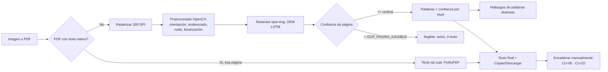

# 04 · Análisis CU-06 · OCR imagen/PDF escaneado a texto (fase 1, MVP)

Versión 0.1 · 2026-10-08 · Relacionado con: RF-11, HU-05, PP-05, PP-06, R-05, R-11, ADR-007, docs/05-prompts/P-08/P-09/P-11

## Antecedentes
CU-05 (ortografía) y CU-02 (redacción) ya informan "PDF sin texto, requiere OCR" (`parsers/pdf.py::PdfSinTextoError`) pero no hacen nada más -- el usuario no tiene forma de extraer texto de una imagen o un PDF escaneado. El Bloque 0 de P-09 confirmó que, más allá del ADR-007 (decisión de stack), no existe ningún código de OCR en el repositorio.

## Objetivo general
Extraer texto legible de imágenes y PDF escaneados, con confianza por palabra, sin inventar contenido en páginas ilegibles y sin alterar jamás cifras/montos/fechas/códigos.

## Objetivos específicos
1. Procesar png/jpg/tiff/bmp y PDF (páginas con texto nativo se usan tal cual; sin texto se rasterizan a 300 DPI).
2. Preprocesar con OpenCV (orientación, enderezado, ruido, binarización) antes de pasar a Tesseract.
3. Clasificar cada palabra por confianza (ilegible/dudosa/revisar/ok) sin generar texto en páginas ilegibles.
4. Sugerir correcciones (LanguageTool + glosario) sin autocorregir ni tocar tokens con dígitos.
5. Encadenar manualmente a CU-05/CU-02 sobre el texto ya extraído.

## In-Scope / Out-of-Scope (fase 1)
| In-Scope | Out-of-Scope (fases siguientes) |
| --- | --- |
| Imagen y PDF, español + inglés | Tablas con rejilla OpenCV (P-09 Bloque 3) |
| Preprocesado determinista (sin LLM) | Post-corrección LLM en segundo plano (P-09 Bloque 2 ya resuelve esto para CU-02; se puede sumar después) |
| Confianza por palabra, página ilegible | Encadenado automático a CU-05/CU-02 (manual en esta fase) |
| Descarga .txt/.docx con dudosas resaltadas | Descarga .xlsx (es de tablas, fase siguiente) |

## Stack (sin librerías nuevas fuera de ADR-007)
Tesseract 5 (binario, vía `pytesseract`) + OpenCV (`opencv-python-headless`) + PyMuPDF (ya en el proyecto, rasteriza PDF a 300 DPI). `tessdata_best` spa+eng se instala en el build de la imagen del orquestador/worker -- sin red en tiempo de ejecución (RNF-01).

## RF/RNF afectados
RF-11 (extracción OCR), RNF-01 (offline), RNF-03 (cifras solo por código, nunca por LLM -- en esta fase ni siquiera hay LLM). Reutiliza RN-06 (LanguageTool+glosario, CU-05), retención de 90 días, bitácora y cola ya existentes.

## Riesgos
Mismos que P-08/ADR-007: stage sin AVX (Tesseract no lo requiere, PaddleOCR sí -- no se usa). Rendimiento de Tesseract en CPU no medido todavía (se mide en el Bloque 4, dataset propio).

## Flujo

