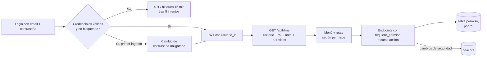

# 05 · Análisis — Menú por permisos, Historial y Configuración (usuarios, roles, áreas)

Versión 0.1 · 2026-10-09 · Relacionado con: RF-01, RF-02, RF-18, RF-19, RNF-02, RN-07, CU-09, CU-10, docs/05-prompts/P-12-usuarios-roles-menu-historial.md

## Antecedentes
El diagnóstico completo está en P-12 §1 (no se repite aquí). En resumen: el rol de un usuario se resuelve hoy por su email contra un diccionario fijo en código (`comun/seguridad.py`), no contra la tabla `rol` real; la tabla `permiso` existe sin usarse; el menú muestra las mismas 5 opciones a todos los roles; Historial está en "Próximamente"; Configuración no tiene opciones.

## Objetivo general
Que cada usuario vea y use solo lo que su rol permite (menú, rutas y API), consulte su historial de análisis, y que el Administrador gestione usuarios/roles/áreas desde la aplicación -- sin contraseñas fijas en el código.

## Objetivos específicos
1. Autenticación local con contraseña propia por usuario (bcrypt), cambio obligatorio en el primer ingreso, bloqueo tras intentos fallidos.
2. Autorización por permisos (`recurso:accion`) en el backend, no solo por rol fijo -- la UI nunca es la única barrera (RNF-02).
3. Menú y rutas construidos desde los permisos reales del usuario autenticado.
4. Historial con filtros y alcance (propio/área/todas) según permiso.
5. Configuración: CRUD de usuarios, matriz de permisos editable y CRUD de áreas, con las reglas de protección de `docs/03-diseno/seguridad/roles-permisos.md` v0.3.

## In-Scope / Out-of-Scope
| In-Scope | Out-of-Scope |
| --- | --- |
| Permisos por rol en tabla `permiso`, aplicados en API y UI | Integración AD/LDAP (se deja `origen_autenticacion` como gancho) |
| CRUD de usuarios y áreas; edición de permisos de los 5 roles existentes | Crear roles nuevos (los 5 del SRS quedan fijos) |
| Historial con filtros, paginación y enlace al resultado | Borrado físico de usuarios o de bitácora (siempre append-only / desactivación) |
| Contraseñas bcrypt, cambio obligatorio, bloqueo por intentos | SSO / MFA |
| Comando de rescate para el primer Administrador en stage | Reportes avanzados o exportación a BI |

## RF/RNF afectados
RF-01 (autenticación, ahora con contraseña propia y bloqueo), RF-02 (administrar usuarios/roles/áreas, antes sin implementar), RF-18 (historial con filtros y alcance), RF-19 (bitácora: nuevos eventos de seguridad), RNF-02 (autorización siempre en el backend). Reutiliza RN-07/segregación de funciones (`SEGREGACION_APROBACION`) sin cambios.

## Riesgos
Ver P-12 §7 (R-P1 a R-P4): quedar sin Administrador activo, romper endpoints al migrar de `requiere_rol` a `requiere_permiso` (mitigado con la matriz de pruebas del Bloque 0, que debe dar los mismos resultados antes y después), contraseña pública de los usuarios de prueba filtrándose a stage (mitigado: solo se siembran con `APP_ENV=local`), y permisos mal configurados por el propio Administrador (mitigado con filas protegidas y "Restaurar matriz por defecto").

## Flujo

