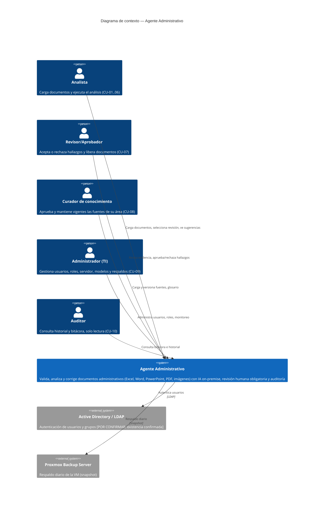

# C4 — Nivel 1: Contexto

**Versión:** 0.1.0
**Fecha:** 2026-09-24
**Relacionado con:** docs/01-requerimientos/01-requerimiento-formal.md §6 (roles), §7 (supuestos)

## Elemento · responsabilidad · tecnología

| Elemento | Responsabilidad | Tecnología |
| --- | --- | --- |
| Agente Administrativo | Sistema central: validación, análisis, corrección y auditoría de documentos | FastAPI + LangGraph + Ollama/llama.cpp (ver docs/03-diseno/c4/02-contenedores.md) |
| Active Directory / LDAP | Fuente de identidad y grupos de la organización | LDAP / AD |
| Proxmox Backup Server | Respaldo a nivel de VM | Proxmox Backup Server |
| Analista / Revisor / Curador / Administrador / Auditor | Roles humanos que interactúan con el sistema | Interfaz web (Open WebUI piloto → UI propia) |

## Supuestos

1. Todos los roles acceden por la misma interfaz web interna, sin salida a internet (RNF-01).
2. La existencia real de Active Directory está [POR CONFIRMAR] (SRS §17.3); si no existe, RF-01 usa únicamente usuarios locales.
3. El sistema no tiene otros sistemas externos en el alcance del piloto (sin integración ERP, sin acceso móvil — ver SRS §5 Out-of-Scope).
4. Proxmox Backup Server aplica solo al ambiente stage; el ambiente local no tiene respaldo formal (es descartable y reproducible).
5. Los cinco roles son mutuamente excluyentes en el modelo de permisos del piloto (un usuario tiene un rol activo a la vez) — ver docs/03-diseno/seguridad/roles-permisos.md.
