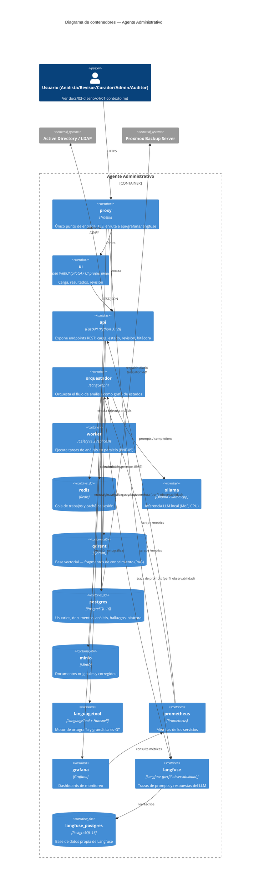

# C4 — Nivel 2: Contenedores

**Versión:** 0.1.0
**Fecha:** 2026-09-24
**Relacionado con:** docs/01-requerimientos/01-requerimiento-formal.md §9 (stack), infra/compose.yml, docs/03-diseno/c4/01-contexto.md

## Elemento · responsabilidad · tecnología

| Elemento | Responsabilidad | Tecnología |
| --- | --- | --- |
| proxy | Único punto de entrada con TLS; único puerto publicado en stage | Traefik |
| ui | Carga de documentos, visualización de hallazgos, revisión | Open WebUI (piloto) → UI propia (React) |
| api | Contrato REST del sistema; autenticación; encola trabajo | FastAPI |
| orquestador | Grafo de estados del análisis: clasifica, invoca validadores, consulta RAG | LangGraph |
| worker | Ejecución paralela de análisis (≥ 2 réplicas en stage, RNF-05) | Celery |
| redis | Cola de trabajos y caché de sesión | Redis |
| ollama | Inferencia del modelo LLM (MoE) en CPU | Ollama / llama.cpp |
| qdrant | Búsqueda semántica de fragmentos de conocimiento | Qdrant + bge-m3 |
| postgres | Datos transaccionales: usuarios, documentos, análisis, hallazgos, bitácora | PostgreSQL 16 |
| minio | Almacenamiento de documentos originales/corregidos | MinIO |
| languagetool | Corrección ortográfica y gramatical es-GT | LanguageTool + Hunspell |
| prometheus / grafana | Métricas y dashboards de monitoreo | Prometheus / Grafana |
| langfuse / langfuse_postgres | Trazabilidad de prompts (RNF-06, RNF-11), BD propia | Langfuse (self-hosted) / PostgreSQL 16 |

## Supuestos

1. `worker` y `orquestador` son procesos separados en el diagrama pero comparten la misma imagen (`agente-admin/orquestador`), ver infra/compose.yml.
2. Solo `proxy` publica puerto en stage (443); el resto vive en la red interna `red_interna` (ver infra/compose.stage.yml).
3. `langfuse` y `prometheus`/`grafana` están bajo el perfil `observabilidad`; en local es opcional, en stage se asume activo salvo indicación contraria.
4. El modelo LLM cargado en `ollama` difiere por ambiente (pequeño en local, objetivo en stage) — ver docs/03-diseno/despliegue/estrategia-ambientes.md.
5. La UI definitiva (React) reemplaza a Open WebUI cuando el piloto avance; ambas hablan el mismo contrato REST de `api` [POR CONFIRMAR fecha de transición].
