# C4 — Nivel 3: Componentes del orquestador

**Versión:** 0.1.0
**Fecha:** 2026-09-24
**Relacionado con:** docs/03-diseno/c4/02-contenedores.md, src/orquestador/README.md, docs/01-requerimientos/02-casos-de-uso.md

```mermaid
C4Component
    title Componentes — contenedor "orquestador" (worker incluido)

    Container_Boundary(orquestador, "orquestador / worker (LangGraph)") {
        Component(receptor, "Receptor de tareas", "Consumer Redis", "Toma el siguiente análisis encolado por la api")
        Component(clasificador, "Clasificador de revisión", "Nodo LangGraph", "Confirma tipo_revision (RF-04) y fuentes a consultar (RF-05)")
        Component(enrutador, "Enrutador de validación", "Nodo LangGraph (switch)", "Deriva al adaptador según tipo_revision")
        Component(adapContable, "Adaptador Contable", "src/validadores/contable", "Cuadre, catálogo, período, duplicados, moneda (RN-01..05)")
        Component(adapControl, "Adaptador Control", "src/validadores/control", "Evalúa checklist contra plantilla vigente")
        Component(adapOrtografia, "Adaptador Ortografía", "src/ortografia", "Ubicación exacta + glosario (RN-06)")
        Component(adapNormativa, "Adaptador Normativa", "Nodo LangGraph + RAG", "Compara contra fuente vigente")
        Component(adapOCR, "Adaptador OCR", "src/ocr", "Preprocesa y extrae texto")
        Component(clienteRAG, "Cliente RAG", "src/rag", "Recupera fragmentos relevantes")
        Component(clienteLLM, "Cliente LLM", "Adaptador Ollama", "Prompts de razonamiento/redacción")
        Component(generador, "Generador de hallazgos", "Nodo LangGraph", "Arma severidad, ubicación, explicación, corrección, fuente (RF-12)")
        Component(corrector, "Generador de documento corregido", "src/parsers", "Aplica correcciones aceptadas al formato original (RF-14)")
        Component(bitacora, "Registrador de bitácora", "src/auditoria", "Registra cada paso relevante (RF-19)")
    }

    ContainerDb(redis, "redis", "Redis")
    Container(qdrant, "qdrant", "Qdrant")
    Container(ollama, "ollama", "Ollama")
    Container(languagetool, "languagetool", "LanguageTool")
    ContainerDb(postgres, "postgres", "PostgreSQL")
    Container(langfuse, "langfuse", "Langfuse (perfil observabilidad)")

    Rel(receptor, redis, "dequeue")
    Rel(receptor, clasificador, "entrega tarea")
    Rel(clasificador, enrutador, "tipo_revision confirmado")
    Rel(enrutador, adapContable, "contable")
    Rel(enrutador, adapControl, "control")
    Rel(enrutador, adapOrtografia, "ortografía")
    Rel(enrutador, adapNormativa, "normativa")
    Rel(enrutador, adapOCR, "OCR")
    Rel(adapNormativa, clienteRAG, "consulta fuentes")
    Rel(adapContable, clienteRAG, "consulta reglas/RN")
    Rel(clienteRAG, qdrant, "búsqueda semántica")
    Rel(adapOrtografia, languagetool, "revisión es-GT")
    Rel(adapNormativa, clienteLLM, "prompt de comparación")
    Rel(clienteLLM, ollama, "completion")
    Rel(clienteLLM, langfuse, "traza de prompt (perfil observabilidad)")
    Rel(adapContable, generador, "hallazgos contables")
    Rel(adapControl, generador, "hallazgos de control")
    Rel(adapOrtografia, generador, "hallazgos ortográficos")
    Rel(adapNormativa, generador, "hallazgos de normativa")
    Rel(generador, postgres, "persiste hallazgos")
    Rel(generador, corrector, "hallazgos aceptados (tras CU-07)")
    Rel(corrector, postgres, "registra version_documento corregida")
    Rel(generador, bitacora, "evento de análisis")
    Rel(bitacora, postgres, "escribe bitacora")
```

## Elemento · responsabilidad · tecnología

| Elemento | Responsabilidad | Tecnología |
| --- | --- | --- |
| Receptor de tareas | Desencola el siguiente análisis pendiente | Celery worker sobre Redis |
| Clasificador de revisión | Confirma tipo de revisión y fuentes a usar | Nodo LangGraph |
| Enrutador de validación | Deriva la tarea al adaptador correspondiente | Nodo LangGraph (switch) |
| Adaptadores (Contable/Control/Ortografía/Normativa/OCR) | Lógica específica de cada caso de uso | `src/validadores/*`, `src/ortografia`, `src/ocr` |
| Cliente RAG | Recupera fragmentos relevantes de la base de conocimiento | `src/rag` + Qdrant + bge-m3 |
| Cliente LLM | Genera explicaciones/sugerencias de texto | Ollama / llama.cpp |
| Generador de hallazgos | Normaliza la salida de cada adaptador a un hallazgo (RF-12) | Nodo LangGraph |
| Generador de documento corregido | Aplica correcciones aceptadas sin dañar el formato original | `src/parsers` (openpyxl/python-docx/python-pptx/PyMuPDF) |
| Registrador de bitácora | Persiste cada acción relevante | `src/auditoria` |

## Supuestos

1. `worker` y `orquestador` comparten el mismo grafo LangGraph; el diagrama los trata como un solo límite de contenedor (ver docs/03-diseno/c4/02-contenedores.md, supuesto 1).
2. Todo cálculo numérico (cuadre, totales) lo hace el Adaptador Contable en código determinista, nunca el Cliente LLM (RNF-03).
3. El Cliente LLM traza cada prompt/respuesta a Langfuse solo si el perfil `observabilidad` está activo; sin él, no hay trazas (solo logs locales).
4. El Adaptador OCR (RF-11, iteración 2) no participa en el flujo de la entrega 1.
5. El Generador de documento corregido solo se invoca después de CU-07 (decisión del Revisor), nunca antes.
