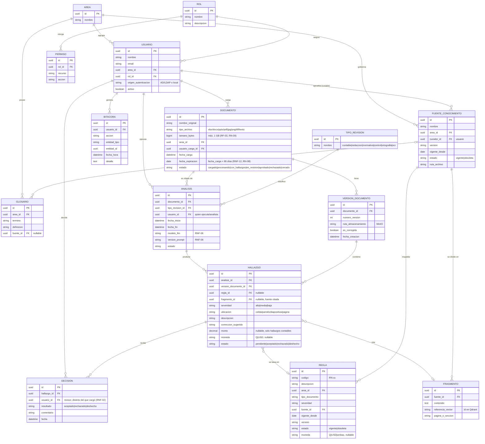

# Modelo de datos (ER)

**Versión:** 0.1.0
**Fecha:** 2026-09-24
**Relacionado con:** docs/01-requerimientos/01-requerimiento-formal.md (RF-01,02,06,12,13,14,16,17,19; RNF-06,12), docs/02-analisis/02-reglas-de-negocio.md

## Elemento · responsabilidad · tecnología

| Elemento | Responsabilidad | Tecnología |
| --- | --- | --- |
| Tablas relacionales (todas) | Persistencia transaccional de negocio | PostgreSQL 16 |
| `version_documento.ruta_almacenamiento` | Referencia al binario real | MinIO (bucket `documentos`) |
| `fragmento.referencia_vector` | Referencia al embedding para búsqueda semántica | Qdrant (colección `agente_admin_kb`) |
| `regla`, `glosario` | Reflejan `kb/reglas/reglas.csv` y `kb/glosario/glosario.csv` | CSV versionado + tabla espejo en Postgres |

## Supuestos

1. Un `usuario` tiene un único `rol` activo a la vez (simplificación RBAC del piloto; no hay tabla puente `usuario_rol`) — ver docs/03-diseno/seguridad/roles-permisos.md.
2. `hallazgo.monto` y `hallazgo.moneda` solo se completan cuando el hallazgo proviene de una revisión contable (CU-01); en el resto de casos de uso quedan nulos.
3. `documento.fecha_expiracion` se calcula como `fecha_carga + 90 días` (RN-08) y es el disparador de la depuración automática (PP-19); no se modela aquí el job de limpieza en sí (ver docs/03-diseno/flujos/pipeline-validacion.md).
4. `bitacora` es de solo inserción (append-only); ningún proceso la actualiza ni la borra (RF-19, principio de auditoría).
5. El binario original y el corregido son dos filas de `version_documento` del mismo `documento`, no un documento distinto — así se conserva la trazabilidad completa de versiones.
