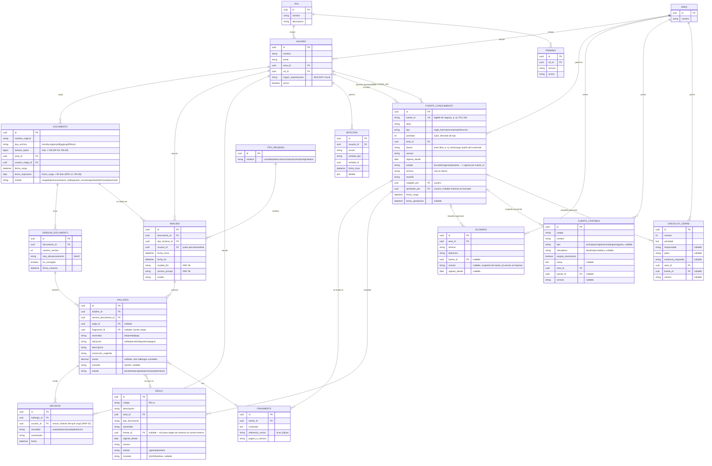

# Modelo de datos (ER)

**Versión:** 0.2.0
**Fecha:** 2026-09-29
**Relacionado con:** docs/01-requerimientos/01-requerimiento-formal.md (RF-01,02,06,12,13,14,16,17,19; RNF-06,12), docs/02-analisis/02-reglas-de-negocio.md, docs/04-pruebas/resultados/local-SKB.md (Bloque K1)

```mermaid
erDiagram
    AREA ||--o{ USUARIO : "agrupa"
    AREA ||--o{ FUENTE_CONOCIMIENTO : "gobierna"
    AREA ||--o{ GLOSARIO : "posee"
    ROL ||--o{ USUARIO : "asigna"
    ROL ||--o{ PERMISO : "otorga"
    USUARIO ||--o{ DOCUMENTO : "carga"
    USUARIO ||--o{ ANALISIS : "ejecuta"
    USUARIO ||--o{ DECISION : "decide"
    USUARIO ||--o{ BITACORA : "genera"
    USUARIO |o--o{ FUENTE_CONOCIMIENTO : "aprueba (aprobado_por, curador)"
    DOCUMENTO ||--o{ VERSION_DOCUMENTO : "tiene"
    DOCUMENTO ||--o{ ANALISIS : "es objeto de"
    TIPO_REVISION ||--o{ ANALISIS : "clasifica"
    ANALISIS ||--o{ HALLAZGO : "produce"
    HALLAZGO ||--o{ DECISION : "recibe"
    HALLAZGO }o--o| REGLA : "se basa en"
    HALLAZGO }o--o| FRAGMENTO : "cita"
    FUENTE_CONOCIMIENTO ||--o{ FRAGMENTO : "se divide en"
    FUENTE_CONOCIMIENTO ||--o{ REGLA : "respalda"
    FUENTE_CONOCIMIENTO |o--o{ GLOSARIO : "respalda (opcional)"
    FUENTE_CONOCIMIENTO |o--o{ CUENTA_CONTABLE : "respalda (opcional)"
    FUENTE_CONOCIMIENTO |o--o{ CHECKLIST_CIERRE : "respalda (opcional)"
    AREA ||--o{ CUENTA_CONTABLE : "posee"
    AREA ||--o{ CHECKLIST_CIERRE : "posee"
    USUARIO ||--o{ FUENTE_CONOCIMIENTO : "carga (cargado_por)"
    VERSION_DOCUMENTO ||--o{ HALLAZGO : "contiene"

    AREA {
        uuid id PK
        string nombre
    }
    ROL {
        uuid id PK
        string nombre
        string descripcion
    }
    PERMISO {
        uuid id PK
        uuid rol_id FK
        string recurso
        string accion
    }
    USUARIO {
        uuid id PK
        string nombre
        string email
        uuid area_id FK
        uuid rol_id FK
        string origen_autenticacion "AD/LDAP o local"
        boolean activo
    }
    DOCUMENTO {
        uuid id PK
        string nombre_original
        string tipo_archivo "xlsx/docx/pptx/pdf/jpg/png/tiff/texto"
        bigint tamano_bytes "máx. 1 GB (RF-03, RN-09)"
        uuid area_id FK
        uuid usuario_carga_id FK
        datetime fecha_carga
        date fecha_expiracion "fecha_carga + 90 días (RNF-12, RN-08)"
        string estado "cargado|procesando|con_hallazgos|en_revision|aprobado|rechazado|cerrado"
    }
    VERSION_DOCUMENTO {
        uuid id PK
        uuid documento_id FK
        int numero_version
        string ruta_almacenamiento "MinIO"
        boolean es_corregida
        datetime fecha_creacion
    }
    TIPO_REVISION {
        uuid id PK
        string nombre "contable|redaccion|normativa|control|ortografia|ocr"
    }
    ANALISIS {
        uuid id PK
        uuid documento_id FK
        uuid tipo_revision_id FK
        uuid usuario_id FK "quien ejecuta/analista"
        datetime fecha_inicio
        datetime fecha_fin
        string modelo_llm "RNF-06"
        string version_prompt "RNF-06"
        string estado
    }
    HALLAZGO {
        uuid id PK
        uuid analisis_id FK
        uuid version_documento_id FK
        uuid regla_id FK "nullable"
        uuid fragmento_id FK "nullable, fuente citada"
        string severidad "alta|media|baja"
        string ubicacion "celda/parrafo/diapositiva/pagina"
        string descripcion
        string correccion_sugerida
        decimal monto "nullable, solo hallazgos contables"
        string moneda "Q|USD, nullable"
        string estado "pendiente|aceptado|rechazado|deshecho"
    }
    DECISION {
        uuid id PK
        uuid hallazgo_id FK
        uuid usuario_id FK "revisor, distinto del que cargó (RNF-02)"
        string resultado "aceptado|rechazado|deshecho"
        string comentario
        datetime fecha
    }
    FUENTE_CONOCIMIENTO {
        uuid id PK
        string fuente_id UK "legible de negocio, p. ej. POL-001"
        string titulo
        string tipo "regla_interna|normativa|referencia"
        int prioridad "1|2|3, derivado de tipo"
        uuid area_id FK
        string dueno "texto libre, p. ej. área/cargo dueño del contenido"
        string version
        date vigente_desde
        string estado "borrador|vigente|obsoleta -- 1 vigente por fuente_id"
        string archivo "ruta en MinIO"
        string sha256
        uuid cargado_por FK "usuario"
        uuid aprobado_por FK "usuario, nullable mientras es borrador"
        datetime fecha_carga
        datetime fecha_aprobacion "nullable"
    }
    FRAGMENTO {
        uuid id PK
        uuid fuente_id FK
        text contenido
        string referencia_vector "id en Qdrant"
        string pagina_o_seccion
    }
    REGLA {
        uuid id PK
        string codigo "RN-xx"
        string descripcion
        uuid area_id FK
        string tipo_documento
        string severidad
        uuid fuente_id FK "nullable -- null para reglas de sistema sin fuente externa"
        date vigente_desde
        string version
        string estado "vigente|obsoleta"
        string moneda "Q|USD|ambas, nullable"
    }
    GLOSARIO {
        uuid id PK
        uuid area_id FK
        string termino
        string definicion
        uuid fuente_id FK "nullable"
        string version "nullable, snapshot de fuente_id.version al importar"
        date vigente_desde "nullable"
    }
    CUENTA_CONTABLE {
        uuid id PK
        string codigo
        string nombre
        string tipo "activo|pasivo|patrimonio|ingreso|gasto, nullable"
        string naturaleza "deudora|acreedora, nullable"
        boolean acepta_movimiento
        text notas "nullable"
        uuid area_id FK
        uuid fuente_id FK "nullable"
        string version "nullable"
    }
    CHECKLIST_CIERRE {
        uuid id PK
        int numero
        text actividad
        string responsable "nullable"
        string plazo "nullable"
        string evidencia_requerida "nullable"
        uuid area_id FK
        uuid fuente_id FK "nullable"
        string version "nullable"
    }
    BITACORA {
        uuid id PK
        uuid usuario_id FK
        string accion
        string entidad_tipo
        uuid entidad_id
        datetime fecha_hora
        text detalle
    }
```

## Elemento · responsabilidad · tecnología

| Elemento | Responsabilidad | Tecnología |
| --- | --- | --- |
| Tablas relacionales (todas) | Persistencia transaccional de negocio | PostgreSQL 16 |
| `version_documento.ruta_almacenamiento` | Referencia al binario real | MinIO (bucket `documentos`) |
| `fragmento.referencia_vector` | Referencia al embedding para búsqueda semántica | Qdrant (colección `agente_admin_kb`) |
| `regla`, `glosario`, `cuenta_contable`, `checklist_cierre` | Fuente de verdad gobernada (Bloque K1) -- reemplazan los CSV de `kb/reglas/`, `kb/glosario/` y `kb/fuentes/catalogo-cuentas-contabilidad.csv`; se cargan vía la plantilla de importación (Bloque K2) | PostgreSQL (antes: CSV versionado en git) |
| `fuente_conocimiento` → una vigente por `fuente_id` | Índice único parcial (`WHERE estado='vigente'`) + `curaduria.fuentes.aprobar_fuente` | PostgreSQL + `src/curaduria` |

## Supuestos

1. Un `usuario` tiene un único `rol` activo a la vez (simplificación RBAC del piloto; no hay tabla puente `usuario_rol`) — ver docs/03-diseno/seguridad/roles-permisos.md.
2. `hallazgo.monto` y `hallazgo.moneda` solo se completan cuando el hallazgo proviene de una revisión contable (CU-01); en el resto de casos de uso quedan nulos.
3. `documento.fecha_expiracion` se calcula como `fecha_carga + 90 días` (RN-08) y es el disparador de la depuración automática (PP-19); no se modela aquí el job de limpieza en sí (ver docs/03-diseno/flujos/pipeline-validacion.md).
4. `bitacora` es de solo inserción (append-only); ningún proceso la actualiza ni la borra (RF-19, principio de auditoría).
5. El binario original y el corregido son dos filas de `version_documento` del mismo `documento`, no un documento distinto — así se conserva la trazabilidad completa de versiones.
6. `regla.estado`/`regla.version` (existentes desde antes del Bloque K1) se mantienen como campos propios en vez de derivarse por join contra `fuente_conocimiento.estado`: algunas reglas de sistema (p. ej. RN-07..RN-09) no tienen `fuente_id` (son intrínsecas al código, no respaldadas por un documento cargado) y necesitan un estado propio independiente. `glosario`/`cuenta_contable`/`checklist_cierre` en cambio no repiten `estado` -- su vigencia se deriva enteramente de `fuente_conocimiento.estado` vía `fuente_id` (todas sus filas vienen de una fuente cargada, la plantilla del Bloque K2 no tiene columna de estado en esas hojas).
7. `regla`/`glosario`/`cuenta_contable`/`checklist_cierre` son un espejo informativo/citable de lo que hay en la base de conocimiento (para citar en hallazgos y para el importador del Bloque K2) -- **no** son la fuente que ejecuta la validación en tiempo real: la lógica de RN-01..RN-09 sigue hardcodeada en `src/validadores/contable/reglas.py` (RNF-03). Una fila en `regla` documenta una regla; no la implementa.
