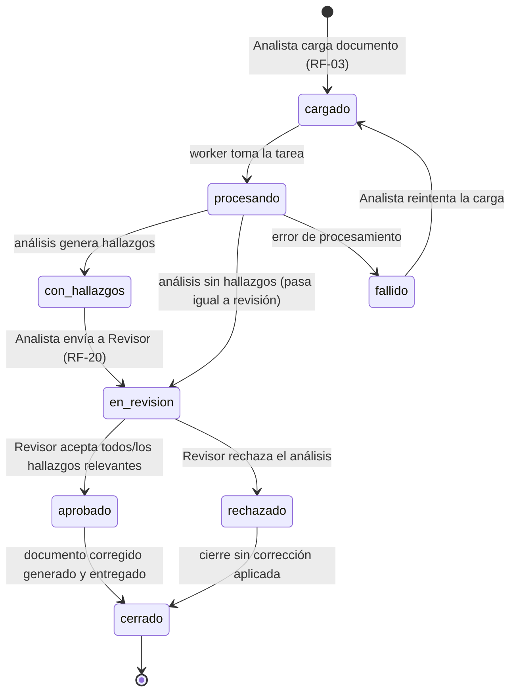

# Estados del documento/análisis

**Versión:** 0.1.0
**Fecha:** 2026-09-24
**Relacionado con:** docs/03-diseno/er/modelo-datos.md (`documento.estado`), docs/01-requerimientos/02-casos-de-uso.md

## Elemento · responsabilidad · tecnología

| Estado | Responsabilidad / condición de entrada | Quién lo produce |
| --- | --- | --- |
| `cargado` | Documento recibido y almacenado en MinIO, metadatos en Postgres | api |
| `procesando` | Worker ejecutando el análisis (adaptador correspondiente) | worker/orquestador |
| `con_hallazgos` | Análisis terminó y generó al menos un hallazgo | worker/orquestador |
| `en_revision` | Hallazgos (o ausencia de ellos) esperando decisión del Revisor | api (tras envío, RF-20) |
| `fallido` | Error no recuperable durante el procesamiento | worker/orquestador |
| `aprobado` | Revisor decidió sobre los hallazgos y el resultado es positivo | api (CU-07) |
| `rechazado` | Revisor decidió sobre los hallazgos y el resultado es negativo | api (CU-07) |
| `cerrado` | Ciclo de vida del análisis completado (con o sin corrección aplicada) | worker/orquestador |

## Supuestos

1. `fallido` y su retorno a `cargado` no están en el enunciado original del ciclo de vida; se agregan como manejo de errores razonable (reintento manual por el Analista), a confirmar con el equipo de diseño.
2. "Aprobado" no exige que el 100 % de los hallazgos se acepten; basta con que el Revisor complete su decisión sobre todos ellos (aceptar o rechazar cada uno) — el resultado agregado del documento se marca `aprobado` si al menos una corrección fue aceptada, `rechazado` en caso contrario [POR CONFIRMAR regla exacta].
3. `documento.fecha_expiracion` (retención de 90 días, RN-08) opera de forma transversal a estos estados: un documento puede eliminarse automáticamente desde cualquier estado terminal (`cerrado`) al vencer el plazo — ver docs/03-diseno/flujos/pipeline-validacion.md.
4. No existe una transición directa de `cerrado` hacia atrás; una corrección posterior implica una nueva carga (nuevo `documento`), no reabrir el mismo.
5. El estado se almacena en `documento.estado`; `analisis.estado` (ver modelo de datos) es más granular y no se expone en este diagrama de alto nivel.
