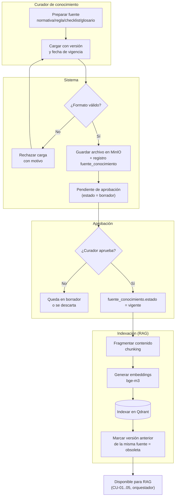

# Flujo — Ingesta de conocimiento

**Versión:** 0.1.0
**Fecha:** 2026-09-24
**Relacionado con:** docs/01-requerimientos/02-casos-de-uso.md#cu-08, RF-16,17

## Elemento · responsabilidad · tecnología

| Elemento | Responsabilidad | Tecnología |
| --- | --- | --- |
| Curador de conocimiento | Prepara, carga y aprueba fuentes de su área | UI + rol Curador |
| Validación de formato | Rechaza cargas mal formadas antes de persistir | api |
| fuente_conocimiento | Registro versionado con vigencia y estado | PostgreSQL 16 |
| Fragmentación + embeddings | Prepara el contenido para búsqueda semántica | `src/rag` + bge-m3 |
| Qdrant | Índice vectorial consultado por el orquestador | Qdrant |

## Supuestos

1. Solo el Curador del área correspondiente puede aprobar una fuente de esa área (segregación por área, RF-02).
2. Una fuente nueva no reemplaza físicamente a la anterior: la anterior pasa a `estado = obsoleta` y se conserva para trazabilidad histórica (no se borra).
3. La reindexación (fragmentación + embeddings) es asíncrona a la aprobación; hasta que termine, la fuente aprobada aún no aparece en resultados de RAG [POR CONFIRMAR tiempo objetivo].
4. El glosario (RF-17) sigue el mismo flujo de aprobación que las demás fuentes, aunque su indexación (paso IDX) es opcional [POR CONFIRMAR si el glosario se indexa en Qdrant o se consulta directo en Postgres].
5. No existe ingesta automática masiva (Out-of-Scope del SRS §5): toda carga es manual, un documento a la vez, dentro del rango de 20–50 documentos de la base de conocimiento del piloto.
