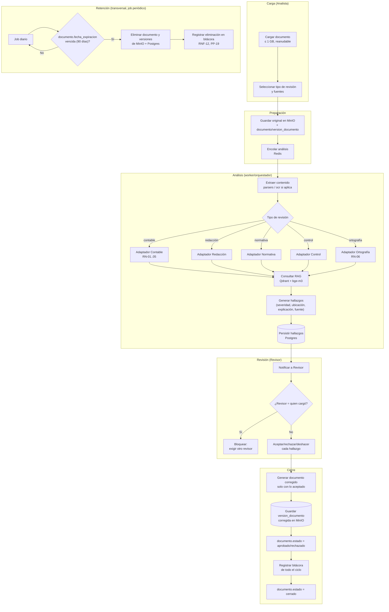

# Flujo — Pipeline de validación de documentos

**Versión:** 0.1.0
**Fecha:** 2026-09-24
**Relacionado con:** docs/01-requerimientos/02-casos-de-uso.md (CU-01 a CU-07), docs/03-diseno/estados/estados-analisis.md

## Elemento · responsabilidad · tecnología

| Elemento | Responsabilidad | Tecnología |
| --- | --- | --- |
| Carga y preparación | Recibe el documento y lo encola para análisis | api, MinIO, Postgres, Redis |
| Análisis | Extrae contenido, enruta al adaptador, consulta RAG, genera hallazgos | worker/orquestador (LangGraph) |
| Revisión | Aplica segregación de funciones y captura la decisión humana | api (CU-07) |
| Cierre | Genera el documento corregido y cierra el ciclo con bitácora | `src/parsers`, `src/auditoria` |
| Retención | Elimina documentos vencidos de forma automática y auditada | job periódico (worker) |

## Supuestos

1. El job de retención (RETENCION) corre independiente del ciclo de un documento individual; se agrupa aquí para mostrar su disparador (`fecha_expiracion`) sin implicar que sea parte del flujo síncrono de análisis.
2. Los cinco adaptadores (G1–G5) son mutuamente excluyentes por análisis: un mismo `analisis` usa un solo tipo de revisión (RF-04), aunque un documento puede tener varios análisis de distinto tipo a lo largo del tiempo.
3. El Adaptador OCR (entrega 2) no aparece en este pipeline de la entrega 1; se incorpora como un paso previo a "Extraer contenido" cuando el documento es una imagen o PDF escaneado.
4. La frecuencia del job de retención (diaria) es una suposición razonable, no está fijada en el SRS [POR CONFIRMAR].
5. Si el análisis falla (ver docs/03-diseno/estados/estados-analisis.md, estado `fallido`), el flujo se interrumpe antes de "Generar hallazgos" y no llega a REVISION.
