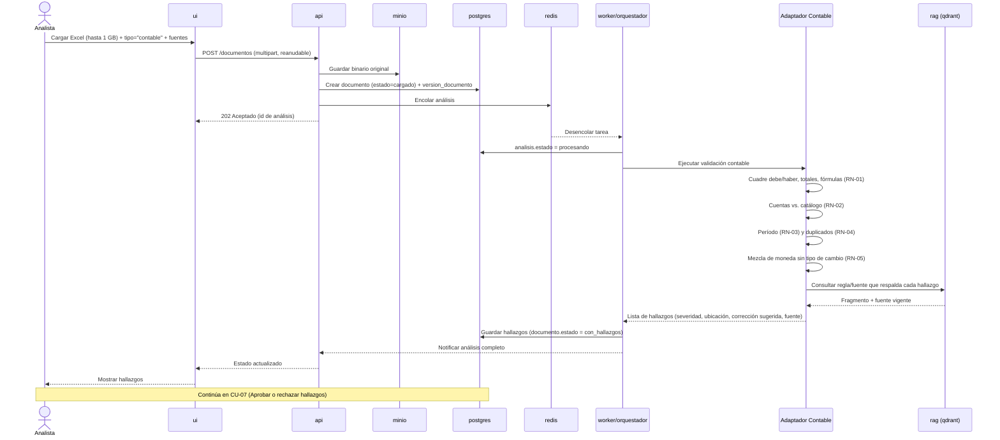

# Secuencia — CU-01 Validar Excel contable

**Versión:** 0.1.0
**Fecha:** 2026-09-24
**Relacionado con:** docs/01-requerimientos/02-casos-de-uso.md#cu-01, RF-03,04,05,06,12,13,14,15; RN-01..05

## Elemento · responsabilidad · tecnología

| Elemento | Responsabilidad | Tecnología |
| --- | --- | --- |
| ui | Formulario de carga y selección de revisión | Open WebUI / UI propia |
| api | Recibe la carga, persiste metadatos, encola el análisis | FastAPI |
| minio | Almacena el binario original | MinIO |
| redis | Cola del análisis pendiente | Redis |
| worker/orquestador | Ejecuta el flujo de análisis | Celery + LangGraph |
| Adaptador Contable | Aplica RN-01 a RN-05 | `src/validadores/contable` |
| rag (qdrant) | Recupera la fuente/regla que respalda cada hallazgo | Qdrant + bge-m3 |
| postgres | Persiste documento, análisis y hallazgos | PostgreSQL 16 |

## Supuestos

1. La carga por partes/reanudable (RF-03) se resuelve en la capa `api`↔`ui`; el diagrama la simplifica a un solo mensaje `POST /documentos`.
2. Todo cálculo numérico (RN-01) lo hace el Adaptador Contable en código determinista, no el LLM (RNF-03); por eso no aparece `ollama` en este diagrama.
3. El worker desencola tan pronto hay capacidad disponible; con ≥ 2 réplicas (RNF-05) varias cargas pueden procesarse en paralelo.
4. Este diagrama termina cuando el documento queda `con_hallazgos`; la aprobación es CU-07 (diagrama aparte).
5. Si no hay fuente/regla que respalde un hallazgo, `rag` devuelve vacío y el hallazgo se marca sin fuente (no bloquea el flujo).
