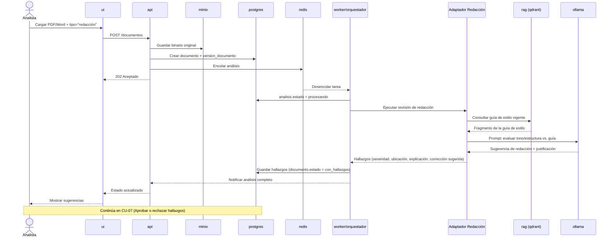

# Secuencia — CU-02 Revisar redacción PDF/Word

**Versión:** 0.1.0
**Fecha:** 2026-09-24
**Relacionado con:** docs/01-requerimientos/02-casos-de-uso.md#cu-02, RF-03,07,12,13,14

## Elemento · responsabilidad · tecnología

| Elemento | Responsabilidad | Tecnología |
| --- | --- | --- |
| Adaptador Redacción | Evalúa tono, estructura y claridad contra la guía de estilo | Nodo LangGraph |
| rag (qdrant) | Recupera la guía de estilo vigente | Qdrant + bge-m3 |
| ollama | Genera la sugerencia de redacción en lenguaje natural | Ollama / llama.cpp (MoE) |
| postgres | Persiste hallazgos y estado del documento | PostgreSQL 16 |

## Supuestos

1. A diferencia de CU-01, aquí el LLM sí participa directamente en generar el contenido de la sugerencia (no es un cálculo numérico, RNF-03 no aplica).
2. Existe una guía de estilo cargada como fuente de conocimiento vigente; si no existe, `AR` devuelve hallazgos genéricos sin cita de fuente [POR CONFIRMAR comportamiento exacto].
3. Si el PDF es una imagen escaneada, el flujo se desvía primero a CU-06 (OCR, entrega 2) antes de llegar a este diagrama.
4. El documento corregido (RF-14) se genera solo tras la decisión del Revisor en CU-07, no en este diagrama.
5. Este flujo es representativo también de CU-03 (verificar normativa) y CU-04 (checklist), que siguen el mismo patrón cambiando el Adaptador y la fuente consultada (ver docs/01-requerimientos/02-casos-de-uso.md).
