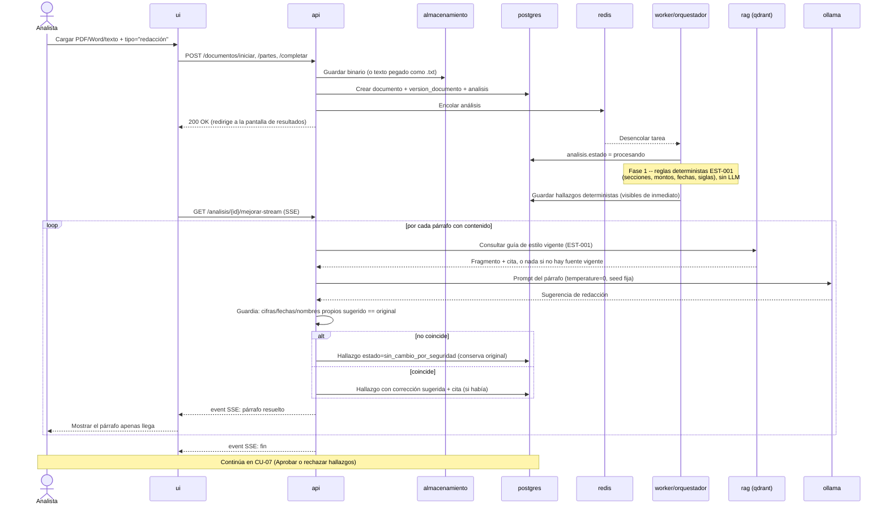

# Secuencia — CU-02 Revisar redacción PDF/Word

**Versión:** 0.2.0
**Fecha:** 2026-10-01
**Relacionado con:** docs/01-requerimientos/02-casos-de-uso.md#cu-02, RF-03,07,12,13,14, docs/02-analisis/02-analisis-cu02-redaccion-amigable.md

v0.2.0: dos fases (determinista + LLM por párrafo con streaming SSE), en vez de una sola pasada en el worker -- ver `docs/02-analisis/02-analisis-cu02-redaccion-amigable.md` §2.1 para la justificación completa. Reemplaza el diagrama de una sola fase de v0.1.0.

```mermaid
sequenceDiagram
    actor AN as Analista
    participant UI as ui
    participant API as api
    participant S3 as almacenamiento
    participant PG as postgres
    participant RD as redis
    participant WK as worker/orquestador
    participant RAG as rag (qdrant)
    participant LLM as ollama

    AN->>UI: Cargar PDF/Word/texto + tipo="redacción"
    UI->>API: POST /documentos/iniciar, /partes, /completar
    API->>S3: Guardar binario (o texto pegado como .txt)
    API->>PG: Crear documento + version_documento + analisis
    API->>RD: Encolar análisis
    API-->>UI: 200 OK (redirige a la pantalla de resultados)

    RD-->>WK: Desencolar tarea
    WK->>PG: analisis.estado = procesando
    Note over WK: Fase 1 -- reglas deterministas EST-001<br/>(secciones, montos, fechas, siglas), sin LLM
    WK->>PG: Guardar hallazgos deterministas (visibles de inmediato)

    UI->>API: GET /analisis/{id}/mejorar-stream (SSE)
    loop por cada párrafo con contenido
        API->>RAG: Consultar guía de estilo vigente (EST-001)
        RAG-->>API: Fragmento + cita, o nada si no hay fuente vigente
        API->>LLM: Prompt del párrafo (temperature=0, seed fija)
        LLM-->>API: Sugerencia de redacción
        API->>API: Guardia: cifras/fechas/nombres propios sugerido == original
        alt no coincide
            API->>PG: Hallazgo estado=sin_cambio_por_seguridad (conserva original)
        else coincide
            API->>PG: Hallazgo con corrección sugerida + cita (si había)
        end
        API-->>UI: event SSE: párrafo resuelto
        UI-->>AN: Mostrar el párrafo apenas llega
    end
    API-->>UI: event SSE: fin

    Note over AN,PG: Continúa en CU-07 (Aprobar o rechazar hallazgos)
```

## Elemento · responsabilidad · tecnología

| Elemento | Responsabilidad | Tecnología |
| --- | --- | --- |
| worker/orquestador | Fase 1: reglas deterministas EST-001, sin LLM | `src/validadores/redaccion/reglas.py` |
| api (endpoint SSE) | Fase 2: una llamada LLM por párrafo + guardia + persistencia, streaming al navegador | FastAPI `StreamingResponse` (`text/event-stream`) |
| rag (qdrant) | Recupera la guía de estilo vigente (EST-001) | Qdrant + bge-m3 |
| ollama | Genera la sugerencia de redacción en lenguaje natural | Ollama (`temperature=0`, `seed` fija) |
| postgres | Persiste hallazgos y estado del documento | PostgreSQL 16 |

## Supuestos

1. **[ACTUALIZADO v0.2.0]** A diferencia de CU-01, aquí el LLM sí participa en generar el contenido de la sugerencia -- por eso se agrega una guardia automática post-LLM (no solo instrucción en el prompt): si las cifras, fechas o nombres propios del párrafo sugerido no coinciden con los del original, se descarta la sugerencia y se conserva el original (`estado="sin_cambio_por_seguridad"`). Detalle en `docs/02-analisis/02-analisis-cu02-redaccion-amigable.md` §2.3.
2. **[ACTUALIZADO v0.2.0]** Si no existe una guía de estilo vigente cargada, el motor corre igual (reglas deterministas + LLM) pero sin "Regla aplicada" en los hallazgos del LLM -- mismo criterio de resiliencia que RN-02 cuando un área no tiene catálogo. Detalle en §2.4 del análisis.
3. Si el PDF es una imagen escaneada, el flujo se desvía primero a CU-06 (OCR, entrega 2) antes de llegar a este diagrama.
4. El documento corregido (RF-14) se genera solo tras la decisión del Revisor en CU-07, no en este diagrama.
5. Este flujo (fase 1 determinista) sigue siendo representativo de CU-03/CU-04; la fase 2 por streaming es específica de CU-02 -- CU-03/CU-04 podrían no necesitarla (verificación normativa/checklist no es "redacción párrafo a párrafo").
