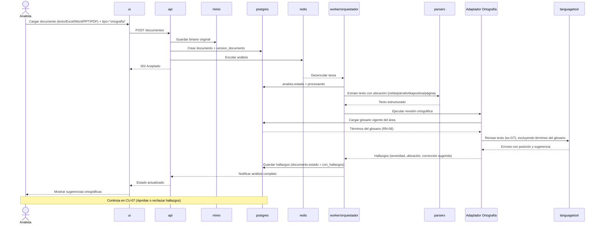

# Secuencia — CU-05 Revisar ortografía multi-formato

**Versión:** 0.1.0
**Fecha:** 2026-09-24
**Relacionado con:** docs/01-requerimientos/02-casos-de-uso.md#cu-05, RF-03,10,14,17; RN-06

## Elemento · responsabilidad · tecnología

| Elemento | Responsabilidad | Tecnología |
| --- | --- | --- |
| parsers | Extrae texto conservando la referencia de ubicación exacta | openpyxl / python-docx / python-pptx / PyMuPDF |
| Adaptador Ortografía | Aplica RN-06 (excluir términos del glosario) y arma hallazgos | `src/ortografia` |
| languagetool | Motor de ortografía y gramática | LanguageTool + Hunspell (es-GT) |
| postgres | Fuente del glosario vigente; persiste hallazgos | PostgreSQL 16 |

## Supuestos

1. Si el documento cargado es una imagen o PDF escaneado sin capa de texto, el flujo se desvía primero a CU-06 (OCR, entrega 2).
2. El glosario se consulta antes de invocar `languagetool`, no después, para no generar y luego descartar hallazgos — optimización, no cambia el resultado final (RN-06).
3. El umbral de recall ≥ 90 % / falsos positivos ≤ 10 % (PP-03) se mide sobre el resultado agregado de `languagetool` + exclusión por glosario, no sobre `languagetool` solo.
4. El documento corregido (RF-14) con las correcciones ortográficas aceptadas se genera solo tras la decisión en CU-07.
5. `languagetool` corre como servicio propio en la red interna, sin acceso a internet (RNF-01).
