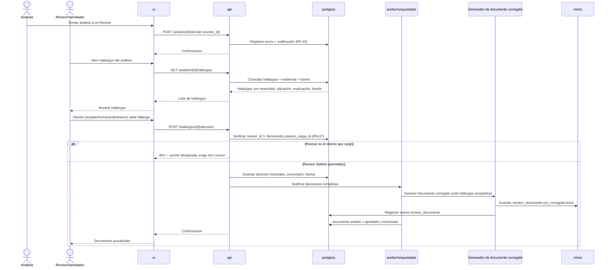

# Secuencia — CU-07 Aprobar o rechazar hallazgos

**Versión:** 0.1.0
**Fecha:** 2026-09-24
**Relacionado con:** docs/01-requerimientos/02-casos-de-uso.md#cu-07, RF-13,14,20; RNF-02; RN-07

## Elemento · responsabilidad · tecnología

| Elemento | Responsabilidad | Tecnología |
| --- | --- | --- |
| api | Valida segregación de funciones antes de aceptar la decisión | FastAPI |
| postgres | Verifica `usuario_carga_id` vs. revisor; persiste `decision` | PostgreSQL 16 |
| Generador de documento corregido | Aplica solo las correcciones aceptadas al formato original | `src/parsers` |
| minio | Almacena la nueva versión corregida del documento | MinIO |

## Supuestos

1. La verificación de segregación de funciones (RN-07) ocurre en `api` antes de tocar cualquier dato, no como validación posterior.
2. "Deshacer" un hallazgo genera una nueva fila en `decision` (historial), no sobrescribe la anterior — ver docs/03-diseno/er/modelo-datos.md.
3. El documento corregido solo se genera si al menos un hallazgo fue aceptado; si todos se rechazan, no hay nueva `version_documento`.
4. La notificación (RF-20) es interna a la aplicación (bandeja/estado); no se asume correo electrónico [POR CONFIRMAR canal real].
5. Este mismo flujo de decisión aplica igual para los hallazgos generados por CU-01, CU-02 y CU-05 (y, en la entrega 2, CU-03/CU-04/CU-06).
