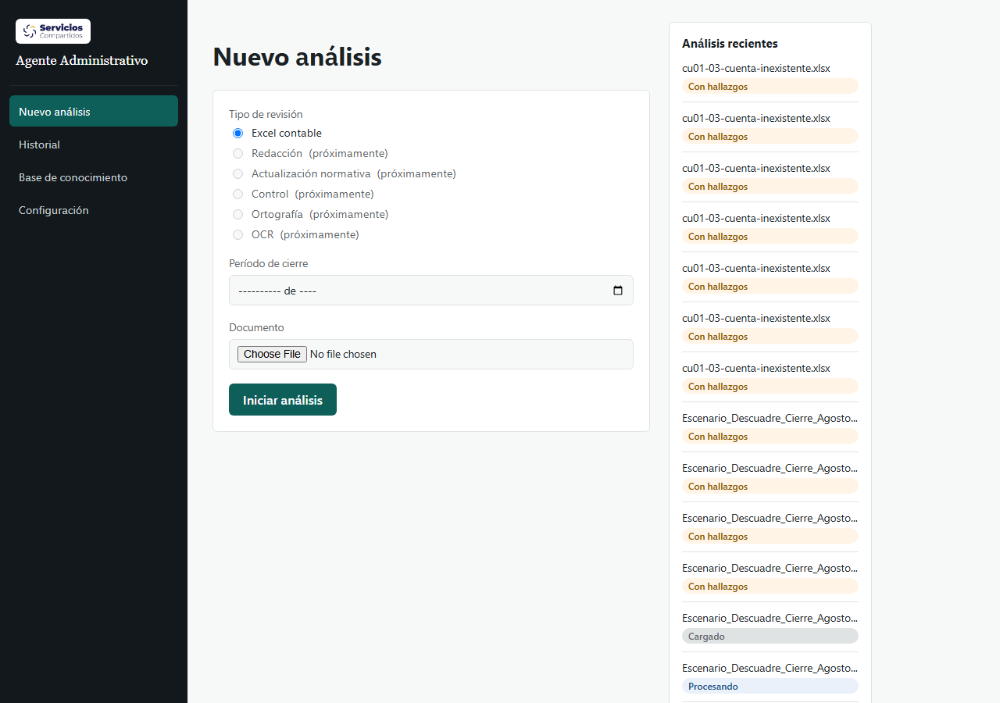
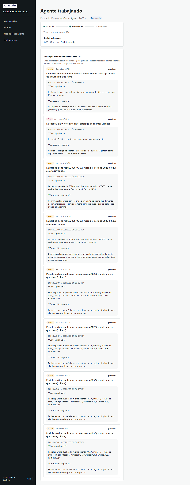
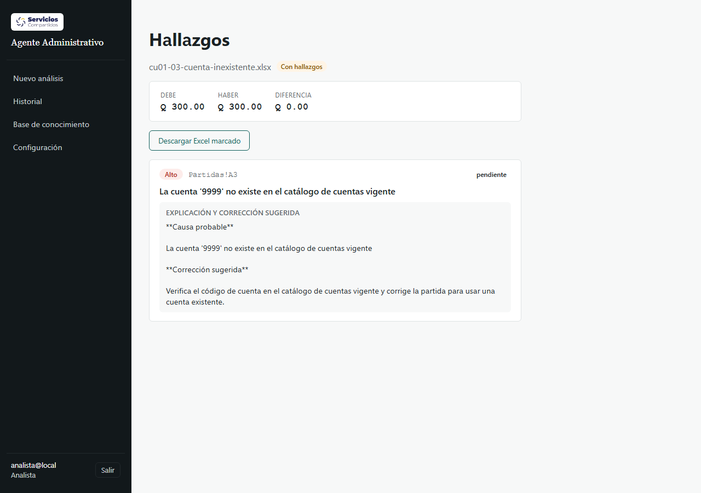

# Resultados — Bloque U5 (frontend CU-01)

**Versión:** 0.1.0
**Fecha:** 2026-09-28
**Relacionado con:** docs/04-pruebas/resultados/local-S1.md, docs/03-diseno/secuencia/cu-01-excel-contable.md

## Alcance

Frontend React/TypeScript (`src/ui/`) de las 3 pantallas de CU-01 — "Nuevo análisis" (U2), "Agente trabajando" (U3, incluida la vista progresiva de hallazgos agregada en este bloque) y "Hallazgos" (U4) — más el cierre del Bloque U5: logo de Servicios Compartidos en el header, suite E2E permanente con Playwright, y auditoría de accesibilidad AA con axe-core.

## Pruebas de componentes (Vitest + Testing Library)

```
6 archivos de prueba, 30 pruebas — todas pasan
```

Cubren: `ContextoAuth`, `RutaProtegida`, `useAnalisisEnVivo` (incluida la nueva prueba de que expone los hallazgos deterministas ya persistidos mientras el análisis sigue `procesando`), `useTiempoTranscurrido`, `PanelAnalisisRecientes`, `TarjetaHallazgo`.

`oxlint` y `tsc -b`: sin errores (2 warnings preexistentes, no relacionados con este bloque: `react(only-export-components)` en `ContextoAuth.tsx` y `react(set-state-in-effect)` en `PanelAnalisisRecientes.tsx`).

## Suite E2E permanente (Playwright, `@playwright/test` como devDependency)

Nueva: `src/ui/e2e/`, corre con `npm run test:e2e` (`playwright.config.ts`) contra el stack local ya levantado (no arranca su propio servidor: la UI depende de Postgres/Qdrant/LocalStack/Ollama reales, que un `webServer` de Playwright no podría replicar).

```
4 pruebas, 4 pasan (Chromium)
```

| Prueba | Verifica |
| --- | --- |
| `flujo-analista-revisor.spec.ts` | El Analista sube `cu01-03-cuenta-inexistente.xlsx` (RN-02, sin LLM — rápido y repetible), llega a Pantalla 3, ve la tarjeta del hallazgo, **no** tiene botón "Aceptar" (RN-07/PP-09: quien no tiene rol Revisor/Administrador nunca puede decidir). El Revisor inicia sesión en un contexto de navegador aparte, encuentra el mismo análisis por el panel "Análisis recientes" (navegación de cliente — ver nota abajo) y sí puede aceptarlo. |
| `accesibilidad.spec.ts` (3 casos) | Auditoría axe-core (WCAG 2.0/2.1 A y AA) sobre Login, Pantalla 1, Pantalla 2 y Pantalla 3 — ver sección siguiente. |

**Hallazgo real durante el desarrollo de esta prueba:** un primer intento navegaba al Revisor directo a la URL de hallazgos con `page.goto(...)`. Falló porque el token de sesión vive solo en memoria (`ContextoAuth.tsx`, sin `localStorage`/cookies, por diseño) — una navegación dura (recarga completa) lo pierde y redirige a `/login`. Confirma en la práctica el mismo comportamiento ya documentado para el flujo de Revisor en bloques anteriores: hay que llegar por un enlace de la SPA (navegación de cliente), no por URL directa/marcador. No es un bug: es el costo esperado de la decisión de no persistir el token; queda anotado por si en algún momento se quiere un flujo de "compartir enlace al análisis" (implicaría reconsiderar esa decisión).

## Accesibilidad AA (axe-core, WCAG 2.0/2.1 A+AA)

```
0 violaciones en las 4 pantallas auditadas (Login, Nuevo análisis, Agente trabajando, Hallazgos)
```

Auditoría automatizada con `@axe-core/playwright` sobre las pantallas reales (no una copia aislada), incluida la vista progresiva de hallazgos de Pantalla 2 y las tarjetas de decisión de Pantalla 3. No sustituye una revisión manual completa (lector de pantalla, navegación solo-teclado en todos los flujos, zoom 200%), pero cubre las reglas automatizables de contraste, roles ARIA, etiquetas de formulario y estructura semántica — no encontró nada que corregir en este bloque.

## Logo en el header

`logoservicioscompartidos.jpg` (fuente: `src/images/`) se procesó a PNG con fondo transparente (blanco eliminado, recortado al contenido) y se agregó a `src/ui/src/assets/`. Se integró en `Layout.tsx`/`Layout.css` sobre una placa clara (el logo tiene texto en tono oscuro, que se perdía contra el fondo oscuro del sidebar).

## Vista progresiva de hallazgos (Pantalla 2)

`useAnalisisEnVivo` ahora también sondea `GET /analisis/{id}/hallazgos` en cada ronda (cada 3 s, igual que `/analisis/{id}` y `/bitacora`). `AgenteTrabajando.tsx` muestra los hallazgos deterministas (RN-02/RN-03/RN-04/RN-FORMULA) tan pronto quedan persistidos — ver `perf(contable)` del mismo día en `local-S1.md`: quedan visibles ~15 s después de completar la carga, mucho antes de que termine la llamada por lote al LLM (RN-01/RN-05) que puede tardar más de 2 min. Verificado en vivo: ver captura de Pantalla 2 abajo, tomada con el análisis en estado "Procesando" y 8 de 10 hallazgos ya visibles a los 3 s.

## Capturas (Chromium real, stack completo sin mocks)

### Pantalla 1 · Nuevo análisis



### Pantalla 2 · Agente trabajando (vista progresiva, análisis todavía "Procesando")



### Pantalla 3 · Hallazgos



## Hallazgo de esta fase (no corregido, fuera de alcance de este bloque)

`TarjetaHallazgo` muestra `correccion_sugerida` como texto plano (`<p>{...}</p>`), pero `validadores/contable/explicacion.py` lo formatea con marcadores Markdown (`**Causa probable**`, `**Corrección sugerida**`) — se ven literales en pantalla (visible en las capturas de arriba) en vez de en negrita. Es un comportamiento preexistente (mismo componente, sin cambios en este bloque) y no fue parte de lo pedido; queda anotado para un bloque futuro si se decide corregirlo (opciones: un renderer Markdown mínimo en el frontend, o separar `causa_probable`/`correccion_sugerida` como campos independientes en vez de un solo texto formateado).

## Pendiente

- Revisión manual de accesibilidad (lector de pantalla, navegación 100 % por teclado, zoom 200 %) — axe-core solo cubre las reglas automatizables.
- El renderizado de Markdown en `correccion_sugerida` (ver hallazgo arriba).
- Historial (`/historial`) sigue siendo un placeholder ("Próximamente") — el Revisor encuentra análisis de otros usuarios por el panel "Análisis recientes" de Pantalla 1, no por una vista de historial dedicada.
