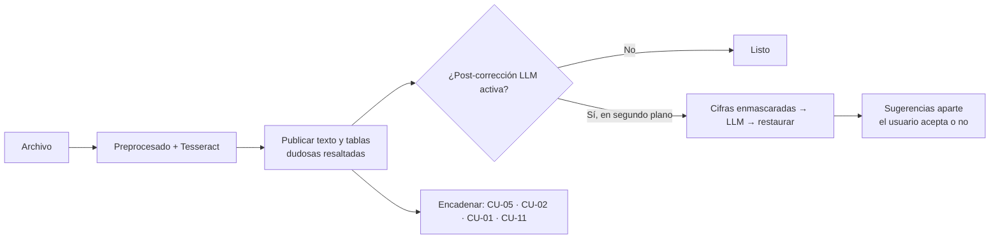

# P-09 · Cierre de CU-06 · OCR imagen a texto

Versión 1.0 · 2026-10-07 · Ejecutor: Claude Code · Base: P-08 · Trazabilidad: CU-06, HU-05, RF-11, PP-05, PP-06, R-05, R-11, ADR-008

## Por qué un prompt de cierre
P-08 definió el alcance completo, pero no hay evidencia en `estado-proyecto.md` de qué bloques quedaron hechos. Este prompt **diagnostica primero** y solo construye lo que falta, para no gastar tokens rehaciendo trabajo. Además incorpora lo aprendido en CU-02 (ADR-008): el LLM en CPU tarda de forma impredecible (8–209 s por recarga del modelo), así que el OCR **nunca debe esperar al LLM** para mostrar resultados.

## Decisiones incluidas
| Tema | Decisión | Motivo |
| --- | --- | --- |
| Umbral de confianza | Dos niveles: &lt;60 = **dudosa** (rojo), 60–79 = **revisar** (amarillo), ≥80 sin marca. Configurable en `.env` | HU-05 pide resaltar &lt;80 %; P-08 decía &lt;60. Ambos quedan cubiertos |
| LLM en OCR | Opcional y en segundo plano; el texto se publica apenas termina Tesseract | Misma lección de CU-02/CU-05: publicar rápido y validar después |
| Cifras | El LLM recibe las cifras enmascaradas (`⟦N1⟧`) y se restauran por código | Garantiza 0 cifras alteradas (PP-02) sin depender del modelo |
| Stage sin AVX | Solo Tesseract 5 + OpenCV; nada que requiera AVX | R-11, ADR-005 |
| Tablas OCR | Botón extra "Revisar estructura" (CU-11) además de "Validar como Excel contable" (CU-01) | Encadena con la nueva opción de hojas de cálculo |



## Prompt

```xml
<tarea>Cierra CU-06 (OCR imagen/PDF escaneado → texto) según docs/05-prompts/P-09-cierre-cu06-ocr.md, usando P-08 como especificación base. Responde en español. Detente al final de cada bloque.</tarea>

<contexto>RF-11, HU-05, PP-05 (CER ≤5 % legibles), PP-06 (100 % ilegibles informados), R-11 (stage sin AVX). Reutiliza cola, bitácora, UI, conversor de salidas y el patrón "publicar y validar en segundo plano" de CU-05/CU-02. Respeta ADR-008: no cambies el modelo LLM. Sin internet en ejecución: tessdata_best spa+eng dentro de la imagen Docker. Propón ADR antes de agregar librerías nuevas.</contexto>

<bloque id="0" nombre="Diagnóstico (sin escribir código)">
Revisa src/, tests/, docs/ y git log contra la lista de P-08 (bloques 1–5). Entrega una tabla: ítem · estado (hecho / parcial / falta) · evidencia (archivo o prueba). Ejecuta las pruebas existentes de CU-06 y reporta resultados. Propón el orden de los bloques siguientes saltando lo que ya esté hecho. Espera mi visto bueno.
</bloque>

<bloque id="1" nombre="Motor e integración">
Completa lo faltante del motor: imágenes y PDF (páginas sin texto → 300 DPI → OCR), OSD + enderezado + limpieza + binarización. Reemplaza el mensaje "requiere OCR" de CU-05/CU-02 por la llamada real a CU-06. Verifica que tesseract y traineddata estén en la imagen Docker (build sin red) y que funcione sin AVX.
</bloque>

<bloque id="2" nombre="Calidad y no inventar">
Umbrales configurables: OCR_CONF_DUDOSA=60, OCR_CONF_REVISAR=80, OCR_PAGINA_ILEGIBLE=50. Página ilegible → mensaje, cero texto. Post-corrección LanguageTool + glosario síncrona; LLM opcional en segundo plano (temperature=0, seed fija, una llamada por página, num_predict acotado, texto plano). Antes del LLM enmascara números, montos, fechas y códigos con marcadores y restáuralos por código; si el LLM toca un marcador, descarta su sugerencia. Las sugerencias del LLM nunca se aplican solas: se muestran para aceptar.
</bloque>

<bloque id="3" nombre="Tablas">
Rejilla OpenCV → celdas → OCR por celda (whitelist numérica en columnas de montos) → .xlsx con dudosas en amarillo/rojo. Si hay Debe/Haber: botón "Validar como Excel contable" (CU-01). Para cualquier tabla: botón "Revisar estructura" (CU-11; si CU-11 aún no existe, deja el botón oculto tras una bandera).
</bloque>

<bloque id="4" nombre="Interfaz">
Opción "Imagen a texto": carga múltiple, vista imagen | texto lado a lado con resaltado por nivel, edición manual, Copiar, Descargar .txt/.docx/.xlsx, encadenar a CU-05/CU-02. Progreso en vivo "Página N de M · Ss". Bitácora: archivo, páginas, confianza media, ediciones, descargas.
</bloque>

<bloque id="5" nombre="Pruebas y cierre">
Dataset tests/dataset/cu-06/ (P-08 bloque 5) si falta. Mide: CER por archivo, PP-06, cifras alteradas (debe ser 0), segundos por página sin LLM (meta ≤30 s) y con LLM (informativo). Actualiza plan-pruebas, matriz de trazabilidad, estado-proyecto y demo-guion.
</bloque>

<reglas>TDD. Un commit por bloque (Conventional Commits) y push. Sin secretos ni datos reales. No mostrar archivos completos en el chat.</reglas>
<salida_en_chat>Por bloque: tabla ruta · cambio · prueba (ok/falla) · métrica · "¿Continúo con &lt;siguiente&gt;?".</salida_en_chat>
```

## Definición de terminado
- PP-05: CER ≤5 % en legibles y tabla · PP-06: 100 % ilegibles informados, 0 texto inventado.
- 0 cifras alteradas por la post-corrección.
- ≤30 s por página en CPU sin LLM; el texto aparece antes de que termine el LLM.
- Funciona en contenedor sin red y sin AVX.
