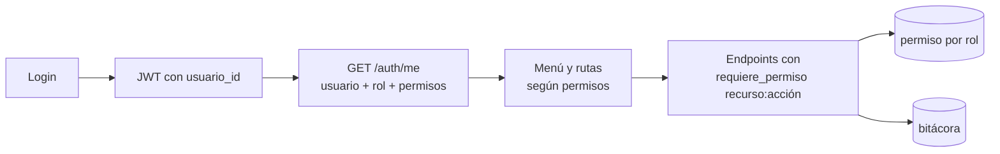

# P-12 · Menú por permisos, Historial y Configuración (usuarios, roles y áreas)

Versión 1.0 · 2026-10-09 · Ejecutor: Claude Code · Trazabilidad: RF-01, RF-02, RF-18, RF-19, RNF-02, RN-07, CU-09, CU-10 · Base: `docs/03-diseno/seguridad/roles-permisos.md` v0.2.0

## 1. Antecedentes (diagnóstico del código al 2026-10-09)
| Tema | Situación actual | Evidencia |
| --- | --- | --- |
| Login | Solo usuarios de prueba fijos en código, contraseña única pública `cambiar123` | `comun/seguridad.py` (`_USUARIOS_DE_PRUEBA`), `POST /auth/login` |
| Rol del usuario | Se obtiene del email contra los usuarios de prueba, **no** de la base de datos | `api/main.py::_nombre_rol` |
| Tabla `permiso` | Existe, sin uso | `comun/modelos.py::Permiso` |
| Autorización | Por rol fijo en cada endpoint (`requiere_rol(...)`) | `api/main.py` |
| Menú | Muestra todas las opciones a todos los roles | UI |
| Historial | Pantalla "Próximamente"; existe `GET /analisis?limite=20` (área o todas) | UI, `api/main.py::listar_analisis` |
| Configuración | Pantalla sin opciones | UI |
| Usuarios en stage | Se siembran a mano con los mismos usuarios de prueba | `comun/semillas.py` |

## 2. Objetivos
**General:** que cada usuario vea y use solo lo que su rol permite, consulte su historial y que el Administrador gestione usuarios, roles y áreas desde la aplicación, sin contraseñas fijas en el código.

**Específicos**
1. Menú y rutas construidos desde los permisos del usuario autenticado (no solo ocultar: el backend también bloquea).
2. Historial con filtros: por defecto "Mis análisis"; "Mi área" y "Todas" según permiso.
3. Configuración (Administrador): usuarios (alta, edición, activar/desactivar, restablecer contraseña), áreas y roles con matriz de permisos.
4. Autenticación local con contraseñas propias en base de datos (bcrypt) y cambio obligatorio en el primer ingreso.
5. Todo cambio de seguridad queda en bitácora.

## 3. Alcance
| In-Scope | Out-of-Scope |
| --- | --- |
| Permisos por rol guardados en `permiso` (recurso + acción) y aplicados en API y UI | Integración AD/LDAP (se deja el campo `origen_autenticacion`) |
| CRUD de usuarios y áreas; edición de la matriz de permisos de los 5 roles existentes | Crear roles nuevos (los 5 roles del SRS quedan fijos) |
| Historial con filtros, paginación y enlace al resultado | Borrado físico de usuarios o bitácora |
| Contraseñas bcrypt, cambio obligatorio, bloqueo por intentos | SSO / MFA (fase posterior) |
| Comando para crear el primer Administrador en stage | Reportes avanzados o exportación a BI |

## 4. Historias de usuario
| ID | Historia | Criterios de aceptación |
| --- | --- | --- |
| HU-20 | Como usuario, quiero ver en el menú solo las opciones de mi rol | Analista: Nuevo análisis, Historial. Revisor: Historial. Curador: Base de conocimiento, Historial. Auditor: Historial, Bitácora, Ajustes autoaprobados. Administrador: Historial, Bitácora, Ajustes autoaprobados, Configuración. URL directa sin permiso → página "Sin acceso" y API 403 |
| HU-21 | Como usuario, quiero ver mi historial de análisis | Lista por defecto "Mis análisis"; filtros fecha, tipo de revisión, estado, archivo; Analista/Revisor/Curador pueden cambiar a "Mi área"; Administrador/Auditor a "Todas" y filtrar por usuario y área; columnas: fecha, archivo, tipo, estado, usuario, duración, hallazgos; clic abre el resultado; paginación de 20 |
| HU-22 | Como Administrador, quiero gestionar usuarios | Crear (nombre, email único, área, rol, contraseña temporal), editar, activar/desactivar (nunca borrar), restablecer contraseña; no puede desactivarse a sí mismo ni dejar el sistema sin Administrador activo |
| HU-23 | Como Administrador, quiero ver y ajustar los permisos por rol | Matriz rol × (recurso, acción) con casillas; protegidos y no editables: `usuarios:administrar` del Administrador y la bitácora de solo lectura; cambios aplican en el siguiente request |
| HU-24 | Como Administrador, quiero gestionar áreas | Crear y renombrar áreas; no se elimina un área con usuarios o documentos |
| HU-25 | Como usuario nuevo, quiero cambiar mi contraseña temporal | Primer ingreso obliga a cambiarla; mínimo 10 caracteres, letras y números; 5 intentos fallidos bloquean 15 min |

## 5. Requerimientos
| Tipo | ID | Requerimiento |
| --- | --- | --- |
| RF | RF-02 | Administrar usuarios, roles (permisos) y áreas |
| RF | RF-18 | Historial de análisis con filtros y alcance por permiso |
| RF | RF-19 | Registrar en bitácora: alta/edición/desactivación de usuario, cambio de rol, cambio de permisos, restablecimiento y cambio de contraseña, bloqueo, inicio de sesión fallido |
| RNF | RNF-02 | Autorización en el backend para cada endpoint; la UI nunca es la única barrera |
| RNF | RNF-SEG-01 | Contraseñas bcrypt; nunca en logs, respuestas ni bitácora |
| RNF | RNF-SEG-02 | Historial responde en ≤ 1 s con 10 000 análisis (índices por fecha, usuario, área) |

## 6. Stack
FastAPI + SQLAlchemy + Alembic (backend), React existente en `src/ui` (frontend), bcrypt y PyJWT ya presentes. Sin librerías nuevas.



## 7. Riesgos
| ID | Riesgo | Mitigación |
| --- | --- | --- |
| R-P1 | Quedar sin Administrador o bloquearse a sí mismo | Reglas en backend + comando de rescate `crear_admin` |
| R-P2 | Romper endpoints al pasar de `requiere_rol` a permisos | Matriz de pruebas parametrizada rol × endpoint antes del cambio (debe dar los mismos resultados) |
| R-P3 | Usuarios de prueba con contraseña pública en stage | Solo se siembran con `APP_ENV=local`; stage usa `crear_admin` |
| R-P4 | Permisos editables mal configurados | Permisos protegidos, botón "Restaurar matriz por defecto", todo cambio en bitácora |

## 8. Prompt (pegar en Claude Code)

```xml
<tarea>Implementa menú por permisos, Historial y Configuración (usuarios, roles, áreas) según docs/05-prompts/P-12-usuarios-roles-menu-historial.md. El diagnóstico está en su sección 1; no lo repitas. Responde en español. Detente al final de cada bloque y espera mi visto bueno.</tarea>

<contexto>
Matriz base: docs/03-diseno/seguridad/roles-permisos.md. Hoy el rol sale de comun/seguridad.py (usuarios fijos, contraseña única) vía api/main.py::_nombre_rol; la tabla permiso existe sin uso. Mantén los 5 roles de RolUsuario. Segmentación por área se conserva (Administrador y Auditor ven todo). SEGREGACION_APROBACION sigue igual. Sin librerías nuevas.
</contexto>

<documentacion>
Antes del bloque 1: actualiza docs/03-diseno/seguridad/roles-permisos.md (v0.3: matriz recurso:acción, menú por rol, reglas de protección) y crea docs/02-analisis/05-analisis-usuarios-roles-historial.md (máx. 1 página: antecedentes, objetivos, in/out scope, RF/RNF, riesgos, Mermaid). Agrega HU-20..25 a docs/01-requerimientos/03-historias-de-usuario.md y actualiza la matriz de trazabilidad.
</documentacion>

<bloque id="0" nombre="Red de seguridad">
Pruebas parametrizadas rol × endpoint con el comportamiento ACTUAL (200/403) para todos los endpoints de api/main.py. Deben pasar antes y después de cada bloque.
</bloque>

<bloque id="1" nombre="Modelo y autenticación">
1. Migración Alembic: usuario.password_hash, debe_cambiar_password, intentos_fallidos, bloqueado_hasta, ultimo_acceso; restricción única permiso(rol_id, recurso, accion); índices analisis(fecha_inicio), documento(usuario_carga_id, area_id).
2. Semilla de permisos desde la matriz v0.3 (idempotente). Recursos sugeridos: analisis:crear, historial:propio, historial:area, historial:todas, hallazgos:decidir, conocimiento:gestionar, conocimiento:aprobar, bitacora:ver, reportes:autoaprobados, usuarios:administrar, roles:administrar, areas:administrar.
3. Login contra la base de datos (bcrypt), bloqueo tras 5 intentos por 15 min, cambio obligatorio de contraseña temporal (POST /auth/cambiar-password). JWT con usuario_id.
4. _nombre_rol y requiere_rol leen el rol desde la base; nuevo requiere_permiso("recurso:accion"). Migra los endpoints a requiere_permiso sin cambiar resultados del bloque 0.
5. Usuarios de prueba: solo se siembran con APP_ENV=local, ya con hash. Comando `python -m comun.crear_admin --email --nombre --area` que pide la contraseña por consola (para stage).
6. GET /auth/me: usuario, rol, área, permisos, debe_cambiar_password.
</bloque>

<bloque id="2" nombre="Menú y rutas por permisos">
UI: el menú y las rutas se construyen desde /auth/me. Sin permiso: la opción no aparece y la URL directa muestra "Sin acceso". Pantalla de cambio de contraseña obligatoria. Muestra rol y área junto al usuario (abajo a la izquierda). Agrega la opción "Bitácora" (Administrador y Auditor, solo lectura, filtros por fecha, usuario y acción).
</bloque>

<bloque id="3" nombre="Historial">
GET /historial con filtros (alcance=propio|area|todas según permiso, desde, hasta, tipo_revision, estado, archivo, usuario_id, area_id) y paginación; incluye usuario, duración (fecha_fin − fecha_inicio) y número de hallazgos. UI según HU-21, con enlace al resultado de cada análisis.
</bloque>

<bloque id="4" nombre="Configuración del Administrador">
Pestañas Usuarios, Roles y permisos, Áreas según HU-22, HU-23, HU-24. Reglas: no borrar usuarios (solo desactivar), no autodesactivarse, siempre al menos un Administrador activo, permisos protegidos no editables, "Restaurar matriz por defecto". Contraseña temporal generada y mostrada una sola vez. Todo cambio a bitácora (sin contraseñas ni hashes).
</bloque>

<bloque id="5" nombre="Pruebas y cierre">
Pruebas: matriz rol × endpoint (bloque 0) en verde; menú por rol (E2E Playwright existente, un caso por rol); historial por alcance; reglas de protección; bloqueo por intentos; ningún hash en respuestas ni bitácora; historial ≤1 s con 10 000 análisis sintéticos. Actualiza plan-pruebas, estado-proyecto, docs/06-operacion (cómo crear el primer Administrador en stage) y el guion de demo (usuarios por rol).
</bloque>

<reglas>TDD. Un commit por bloque (Conventional Commits) y push. Sin secretos ni contraseñas en el repositorio. No mostrar archivos completos en el chat.</reglas>
<salida_en_chat>Por bloque: tabla ruta · cambio · prueba (ok/falla) · "¿Continúo con <siguiente>?".</salida_en_chat>
```

## 9. Despliegue en stage
1. `git pull`; desde `infra/`: `dcs build api orquestador worker ui` y `dcs up -d`.
2. Migración: `dcs exec -w /app/api api python -m alembic upgrade head`.
3. Primer Administrador: `dcs exec api python -m comun.crear_admin --email admin@servicioscompartidos.com --nombre "Administrador" --area Contabilidad`.
4. Entrar como Administrador, crear los usuarios reales del piloto y desactivar los `<rol>@local`.

## 10. Definición de terminado
- Cada rol ve solo sus opciones y la API devuelve 403 fuera de su matriz.
- Historial muestra "Mis análisis" a todo usuario y respeta el alcance por permiso.
- El Administrador crea, edita y desactiva usuarios, áreas y permisos sin tocar código.
- No queda ninguna contraseña fija en el código para stage.
