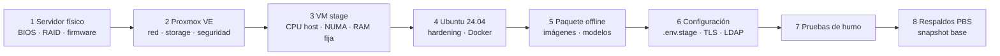

# Guía de despliegue en stage: servidor físico → Proxmox VE → VM → Agente

**Versión:** 1.2
**Fecha:** 2026-09-24
**Relacionado con:** RNF-01, RNF-02, RNF-07, RNF-08, RNF-14, R-10, [docs/03-diseno/despliegue/estrategia-ambientes.md](../03-diseno/despliegue/estrategia-ambientes.md)

> Estado: **pendiente de acceso al stage (previsto 28-oct-2026)**. Esta guía se ejecuta cuando TI otorgue acceso. Valores sin confirmar = `[POR CONFIRMAR]`; cifras = aprox.

## 0. Responsables y prerrequisitos
| Paso | Responsable | Prerrequisito |
| --- | --- | --- |
| 1–2 Servidor físico y Proxmox | TI / Infraestructura | Servidor en rack, energía, red, acceso a consola (iDRAC/iLO/IPMI) |
| 3 VM stage | TI / Infraestructura | Proxmox operativo, almacenamiento y red definidos |
| 4–7 SO, Docker y agente | Equipo del proyecto | Acceso SSH a la VM, paquete offline de la versión |
| 8 Respaldos | TI / Infraestructura | Almacenamiento para Proxmox Backup Server |



## 1. Servidor físico
- BIOS/UEFI: activar virtualización (Intel VT-x/VT-d o AMD-V/IOMMU), NUMA habilitado, perfil de energía "rendimiento".
- Firmware y controladora actualizados; RAID o discos en modo HBA si se usará ZFS. [POR CONFIRMAR: tipo de disco SSD/HDD y controladora]
- Registrar modelo de CPU, núcleos/hilos, RAM exacta (384 o 512 GB) y discos. [POR CONFIRMAR]
- Consola remota (iDRAC/iLO/IPMI) en red de administración separada.

## 2. Proxmox VE
- Instalar la versión estable vigente de Proxmox VE desde ISO oficial. [POR CONFIRMAR versión]
- Almacenamiento: ZFS en espejo (RAID1) o LVM-thin sobre RAID hardware; reservar ~2–2.5 TB para la VM stage.
- Red: bridge `vmbr0`; VLAN de servicios para la VM; VLAN de administración para Proxmox. [POR CONFIRMAR VLAN/IP]
- Seguridad: usuarios nominales con 2FA, firewall de Proxmox activo, acceso web solo desde red de administración, actualizaciones aplicadas.
- Repositorios: enterprise (con suscripción) o no-subscription según política de TI. [POR CONFIRMAR]

## 3. VM stage
| Parámetro | Valor |
| --- | --- |
| Nombre | `agente-stage` |
| SO | Ubuntu Server 24.04 LTS (cloud-init) |
| CPU | type **host**, 2 sockets, núcleos = total físicos − 2–4 para Proxmox [POR CONFIRMAR] |
| NUMA | **Activado** |
| RAM | 256–320 GB **fijos**, ballooning desactivado |
| Disco | 2–2.5 TB, VirtIO SCSI, `discard=on`, caché `none` o `writeback` |
| Red | VirtIO en `vmbr0` + VLAN de servicios |
| Agente QEMU | Activado (snapshots consistentes) |

Coincide con la especificación detallada en [infra/proxmox/vm-spec.md](../../infra/proxmox/vm-spec.md).

Ejemplo de referencia (ajustar valores; lo ejecuta TI):
```bash
qm create 200 --name agente-stage --ostype l26 --machine q35 --bios ovmf \
  --cpu host --sockets 2 --cores <N> --numa 1 \
  --memory 294912 --balloon 0 \
  --scsihw virtio-scsi-single --scsi0 <storage>:2200,discard=on,iothread=1 \
  --net0 virtio,bridge=vmbr0,tag=<VLAN> --agent enabled=1
```

## 4. Sistema operativo y Docker
- Ubuntu 24.04 actualizado, zona horaria `America/Guatemala`, NTP interno.
- Hardening: SSH solo con llave, sin root remoto, `ufw` (entrada solo 443 y 22 desde red de administración), `unattended-upgrades` para seguridad, cifrado de disco o de volúmenes de datos (RNF-02).
- Docker Engine + plugin Compose desde paquetes internos o espejo aprobado.
- Usuario de servicio `agente` sin privilegios; datos en `/srv/agente/` (volúmenes) — ver [infra/compose.stage.yml](../../infra/compose.stage.yml).

## 5. Paquete offline (la VM no tiene internet, RNF-01)
Preparado en local o en una máquina puente con internet — ver [infra/scripts/empaquetar-offline.sh](../../infra/scripts/empaquetar-offline.sh):
```bash
# en la máquina de construcción
docker compose -f compose.yml -f compose.stage.yml build
docker save $(docker compose -f compose.yml -f compose.stage.yml config --images) | gzip > agente-vX.Y.Z-imagenes.tar.gz
# modelos Ollama (copiar carpeta de modelos descargados)
tar czf agente-vX.Y.Z-modelos.tar.gz -C ~/.ollama models
sha256sum agente-vX.Y.Z-*.tar.gz > SHA256SUMS
```
En la VM — ver [infra/scripts/cargar-en-stage.sh](../../infra/scripts/cargar-en-stage.sh):
```bash
sha256sum -c SHA256SUMS
gunzip -c agente-vX.Y.Z-imagenes.tar.gz | docker load
tar xzf agente-vX.Y.Z-modelos.tar.gz -C /srv/agente/ollama/
```

## 6. Configuración
- `.env.stage` a partir de [.env.stage.example](../../.env.stage.example); secretos entregados por canal seguro, nunca en Git.
- `LLM_MODEL_PRINCIPAL` = modelo objetivo aprobado ([ADR-001](../03-diseno/adr/ADR-001-motor-llm-cpu.md)).
- TLS con certificado interno de la organización en el proxy.
- LDAP/AD: cuenta de servicio de solo lectura y mapeo de grupos a roles (Administrador, Curador, Revisor, Analista, Auditor). [POR CONFIRMAR]
- Arranque: `docker compose --env-file .env.stage -f compose.yml -f compose.stage.yml up -d`.

## 7. Pruebas de humo (antes de abrir a usuarios)
- [ ] Todos los contenedores `healthy`.
- [ ] Login con usuario de AD de prueba y rol correcto.
- [ ] Carga y análisis de 1 Excel, 1 Word, 1 PowerPoint, 1 PDF y 1 imagen del dataset.
- [ ] Hallazgo con fuente citada; aprobación por un revisor distinto al que cargó.
- [ ] Bitácora registra todas las acciones.
- [ ] Sin conexiones salientes a internet (PP-14).
- [ ] Tiempo de un documento típico registrado (PP-12).

## 8. Respaldos y recuperación
- Snapshot de Proxmox antes de cada despliegue (rollback inmediato).
- Respaldo diario de la VM con Proxmox Backup Server en almacenamiento externo; retención [POR CONFIRMAR].
- Volcado diario de PostgreSQL y respaldo de MinIO y Qdrant.
- Objetivos: RPO 24 h, RTO 4 h (RNF-07); prueba de restauración trimestral (PP-15). Detalle en [docs/06-operacion/respaldo-y-recuperacion.md](respaldo-y-recuperacion.md).

## 9. Rollback
1. Detener servicios: `docker compose ... down`.
2. Restaurar snapshot previo de la VM en Proxmox, o volver al tag anterior con sus imágenes ya cargadas.
3. Ejecutar pruebas de humo y registrar el incidente.

## 10. Entrega (checklist de TI → proyecto)
- [ ] IP/DNS de la VM y VLAN
- [ ] Acceso SSH con llave para el equipo del proyecto
- [ ] Cuenta de servicio LDAP
- [ ] Certificado TLS interno
- [ ] Destino de respaldos (PBS) configurado
- [ ] Especificaciones reales del servidor documentadas en §1

## 11. Fase 2: incorporación de GPU (≥ 128 GB VRAM)
1. TI valida compatibilidad del servidor: ranura PCIe x16, potencia de la fuente, refrigeración y firmware. [POR CONFIRMAR modelo de GPU]
2. BIOS: IOMMU / VT-d activo. Proxmox: módulos `vfio`, GPU asignada a la VM stage (PCI passthrough).
3. VM: drivers NVIDIA/ROCm según la GPU y NVIDIA Container Toolkit (o equivalente).
4. Desplegar con `compose.yml` + `compose.stage.yml` + `compose.gpu.yml` y `LLM_PROVIDER=vllm`.
5. Repetir PP-12 y PP-13 y documentar la comparación CPU vs GPU en un ADR.
