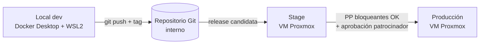
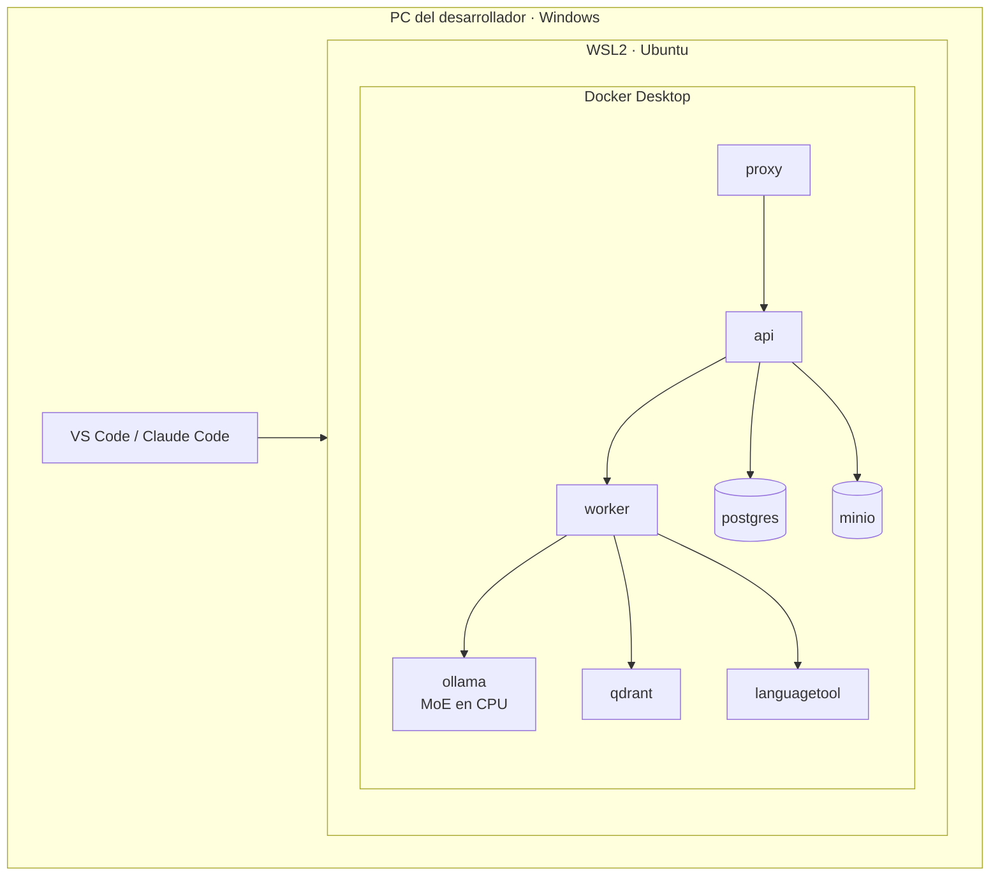
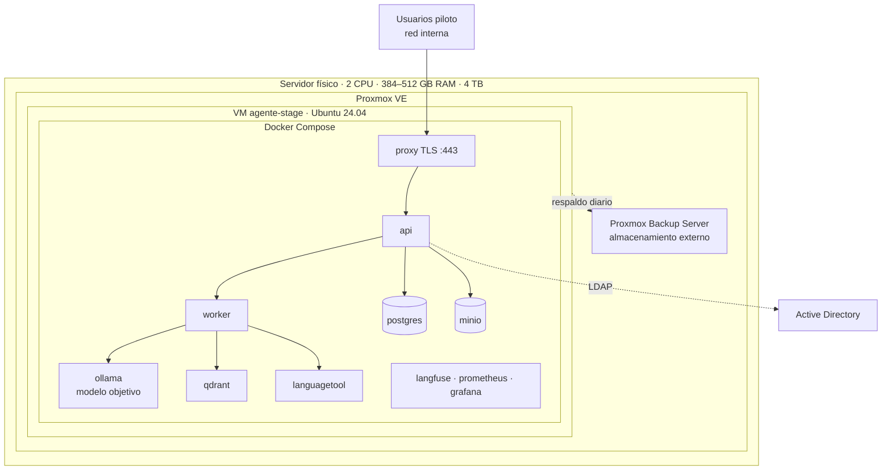

# Estrategia de ambientes y despliegue

**Versión:** 1.2 · **Fecha:** 2026-09-24 · **Relacionado con:** RNF-01, RNF-02, RNF-07, RNF-10, RNF-14, R-02, R-10, ADR-004

## 1. Contexto
- El servidor es **físico**. Sobre él se instala **Proxmox VE** (hipervisor) y luego la infraestructura virtual (VMs).
- El ambiente **stage** en ese servidor **no estará disponible** hasta que se otorgue acceso, previsto para el **28 de octubre de 2026**.
- Por eso el desarrollo se hace en un **ambiente local** y se documenta cómo desplegar en stage/producción sin cambiar código.

## 2. Ambientes
| Ambiente | Dónde corre | Propósito | Modelos LLM | Datos | Acceso |
| --- | --- | --- | --- | --- | --- |
| **Local (dev)** | PC del desarrollador: Windows + WSL2 + Docker Desktop · Intel Core Ultra 7 · 128 GB RAM · SSD · sin GPU dedicada | Desarrollar, pruebas unitarias e integración | gpt-oss-20b / Qwen3-30B-A3B en el día a día; gpt-oss-120b para pruebas puntuales de calidad (lento en CPU), aprox. | Sintéticos / anonimizados (`tests/dataset`) | Solo el desarrollador |
| **Stage** | VM en Proxmox VE sobre el servidor físico | Pruebas de prototipo (PP-01..PP-17), rendimiento real, usuarios piloto | Objetivo (gpt-oss-120b, Qwen3-30B-A3B) | Anonimizados del piloto | 5–10 usuarios piloto, red interna |
| **Producción** (futuro) | VM(s) en Proxmox, mismo servidor u otro [POR CONFIRMAR] | Operación | Aprobados en ADR | Reales | Usuarios autorizados por rol |

## 3. Principio: mismo artefacto, distinta configuración
Lo único que cambia entre ambientes es **configuración**, nunca el código (12-factor):

| Elemento | Local | Stage / Producción |
| --- | --- | --- |
| Código e imágenes Docker | Iguales (mismo tag) | Iguales (mismo tag) |
| Compose | `compose.yml` + `compose.local.yml` | `compose.yml` + `compose.stage.yml` |
| Variables | `.env.local` | `.env.stage` (secretos fuera de Git) |
| Modelo LLM | `LLM_MODEL_PRINCIPAL` pequeño | `LLM_MODEL_PRINCIPAL` objetivo |
| Autenticación | Usuarios locales de prueba | AD/LDAP [POR CONFIRMAR] |
| TLS | Certificado autofirmado (o HTTP en localhost) | Certificado interno de la organización |
| Recursos | Límites bajos | Límites dimensionados (CPU host, NUMA) |
| Internet | Permitido para descargar dependencias/modelos | **Sin salida** (RNF-01): modelos e imágenes se llevan offline |

Ver los archivos reales en [infra/compose.yml](../../../infra/compose.yml), [infra/compose.local.yml](../../../infra/compose.local.yml) e [infra/compose.stage.yml](../../../infra/compose.stage.yml).

## 4. Ambiente local (desarrollo)

- PC confirmada: Intel Core Ultra 7, 128 GB RAM, SSD, sin GPU dedicada (la GPU integrada Intel Arc y la NPU no se usan para inferencia en esta entrega). Espacio libre sugerido: 200 GB (modelos + volúmenes).
- Configurar WSL2 en `%UserProfile%\.wslconfig` (`memory=96GB`, `processors=<núcleos − 2>`, `swap=16GB`): por defecto WSL2 solo usa el 50 % de la RAM.
- Servicios opcionales en local (perfil `observabilidad`): Langfuse [fase 2, ver infra/compose.yml], Prometheus, Grafana.
- El rendimiento en local **no** es representativo; las metas de RNF-04 se miden solo en stage.
- Arranque: [infra/scripts/levantar-local.sh](../../../infra/scripts/levantar-local.sh).

## 5. Ambiente stage (servidor físico → Proxmox → VM → contenedores)

Guía operativa completa: [docs/06-operacion/despliegue-stage-proxmox.md](../../06-operacion/despliegue-stage-proxmox.md).

## 6. Flujo de promoción
1. Desarrollo en rama `feature/*` en local; pruebas unitarias y de integración verdes.
2. Merge a `main` → etiqueta `vX.Y.Z-rc` → construcción de imágenes.
3. Exportar imágenes y modelos a paquete offline (`docker save` + archivos de modelo) con suma de verificación — ver [infra/scripts/empaquetar-offline.sh](../../../infra/scripts/empaquetar-offline.sh).
4. Transferir al servidor por la red interna y cargar en la VM stage — ver [infra/scripts/cargar-en-stage.sh](../../../infra/scripts/cargar-en-stage.sh).
5. Desplegar con `compose.stage.yml`; ejecutar pruebas de humo y PP del plan.
6. Resultado registrado en [docs/04-pruebas/](../../04-pruebas/); si falla, rollback al snapshot previo de Proxmox.

## 7. Supuestos
1. El equipo de TI entrega la VM stage con la especificación de [docs/06-operacion/despliegue-stage-proxmox.md](../../06-operacion/despliegue-stage-proxmox.md).
2. La VM stage no tiene salida a internet; todo se lleva como paquete offline.
3. Existe un repositorio Git interno accesible desde la VM [POR CONFIRMAR].
4. PC de desarrollo confirmada: Intel Core Ultra 7, 128 GB RAM, SSD, sin GPU dedicada.
5. La decisión se formaliza en [ADR-004](../adr/ADR-004-ambientes-local-stage.md) (ambientes local → stage → producción).

## 8. Evolución con GPU (fase 2, fuera de la primera entrega)
Se contempla agregar al servidor físico una GPU (o conjunto) de **al menos 128 GB de VRAM**. [POR CONFIRMAR modelo]

| Aspecto | Primera entrega (CPU) | Fase 2 (GPU ≥ 128 GB VRAM) |
| --- | --- | --- |
| Motor | Ollama / llama.cpp | vLLM (o Ollama con GPU) |
| Modelos | MoE (gpt-oss-120b/20b, Qwen3-30B-A3B) | Los mismos a mayor velocidad; modelos densos de 70B+ o mayor contexto |
| Concurrencia | 5–10 usuarios con cola | Mayor concurrencia por batching |
| Cambios de código | — | Ninguno: solo `LLM_PROVIDER`, `LLM_BASE_URL` y `compose.gpu.yml` (RNF-10, RNF-14) |
| Requisitos de TI | — | Ranura PCIe x16 libre, fuente y refrigeración suficientes, IOMMU activo, passthrough de GPU en Proxmox |
